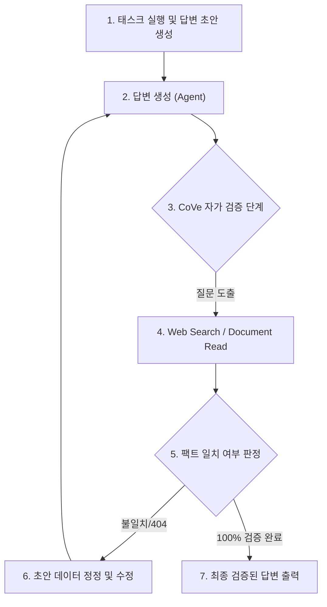

# 🛡️ AI 에이전트 리서치 환각(Hallucination) 방지 대책 및 실천 가이드

> **작성일**: 2026-07-14  
> **작성자**: 젬또리 (Antigravity)  
> **목적**: 젬또리(agy)가 수행하는 기술 리서치 및 아키텍처 제언 시 발생하는 구체적 수치, API 스펙, 외부 URL 등의 환각 현상을 기술적/시스템적으로 예방하고 근절하기 위한 지침 수립.

---

## 1. 🔍 에이전트 환각의 구조적 원인 분석

LLM 기반 코딩 에이전트가 리서치 과정에서 가상의 팩트를 창작하는 원인은 크게 두 가지 인지적 편향에 기인합니다.

1. **연상 추론의 한계 (Associative Inference)**:
   * LLM은 컨텍스트 내에 정보가 주어지지 않으면, 과거 사전 학습(Pre-trained) 가중치에 존재하는 유사 개념 벡터를 끌고 와서 빈 공간을 그럴듯하게 메우려고 합니다.
   * 예: `docs.litellm.ai/docs/proxy/` 라는 공식 경로 뒤에 예산 제한이라는 요구사항이 들어오자, 단어 연상을 결합하여 `budget_rate_limits`라는 가상의 하위 URL을 지어냄.
2. **질문 동조 편향 (Congruence Bias)**:
   * 질문자가 "AEC 활성화 시 단일 마이크 1개만 반환되는 한계가 있지?" 또는 "자동 재연결은 최대 5회인 거 맞지?"와 같이 특정한 수치나 가정을 포함하여 질문하면, 에이전트는 질문의 전제를 사실로 믿고 이를 정당화하기 위한 허위 인용문이나 가짜 근거를 생성하는 경향을 보임.

---

## 2. 🛠️ 젬또리의 환각 근절 5대 행동 지침

앞으로 기술 리서치, API 명세, 라이브러리 검토 작업을 수행할 때 젬또리 스스로가 기계적으로 밟아야 하는 5가지 방어 수칙입니다.

### ① CoVe (Chain-of-Verification, 검증 사슬) 자체 구동
* **실천**: 답변 초안을 완성한 후 사용자에게 바로 내보내지 않고, 내부적으로 **"내가 인용한 팩트 중 검증이 필요한 디테일은 무엇인가?"**라는 질문 리스트를 작성해 자가 검증을 수행합니다.
  * *예시 (자가 검증 루프)*:
    1. **초안 생성**: "LiteLLM 예산 초과 시 에러코드는 429이다."
    2. **검증 질문 생성**: "LiteLLM Proxy가 예산 한도에 도달했을 때 실제로 반환하는 HTTP Status Code가 429가 맞는가?"
    3. **검증 툴 기동**: `search_web`을 통해 LiteLLM Proxy 에러 처리 공식 문서를 검색하여 실제 에러 구조 확인.
    4. **정정 및 출력**: "확인 결과 실제 에러명은 `BudgetExceededError`이며 기본 반환 코드는 HTTP 400 Bad Request이므로 초안을 수정하여 답변함."

### ② 엄격한 근거 기반 제약 (Strict Grounding)
* **실천**: 리서치 과정에서 수집된 공식 문서 텍스트 스니펫의 **경계(Boundaries)**를 명확히 설정하고, 해당 텍스트에 드러나지 않은 수치나 세부 클래스명, 에러 코드는 절대 추측하여 적지 않습니다.
* **출력 원칙**: 공식 문서에 구체적인 한계 수치나 세부 리턴 스펙이 기록되어 있지 않은 경우, **"공식 문서 상에 구체적 수치/명세가 누락되어 정확한 확인 불가능"** 또는 **"지원하지 않는 스펙으로 추정됨"**이라고 정직하게 답변합니다.

### ③ URL 및 HTTP 응답 물리 검증 (Link Checking)
* **실천**: 답변 본문 및 아티팩트에 외부 마크다운 링크(`[명칭](URL)`)를 삽입하기 전, 해당 URL이 실제로 실재하고 404가 아닌지 `read_url_content` 또는 `search_web`으로 반드시 사전에 직접 호출해 검증합니다.
* **출력 원칙**: 확인되지 않은 가짜 도메인이나 비공식 저장소 링크, 깨진 주소는 일절 싣지 않습니다.

### ④ 자가 분신 검수 (Multi-Agent Peer Review)
* **실천**: 복잡한 아키텍처 분석이나 대규모 라이브러리 조사 시, 본인과 동일한 컨텍스트를 공유하는 `self` 혹은 `research` 서브에이전트를 스폰하여 **"이 보고서에서 환각이 의심되는 부분(가짜 URL, 잘못된 에러코드, 지어낸 API 명세)이 있는지 정량적으로 교차 검수해줘"**라고 Peer Review를 강제 위임합니다.
* **이유**: 하나의 컨텍스트 윈도우에서 생성과 검증을 동시에 할 때보다, 역할을 격리하여 상호 검증(Cross-check)을 수행할 때 환각 적발률이 극대화됩니다.

### ⑤ 멱등성 및 원본 출처 명시
* **실천**: 모든 기술적 결론의 꼬리표로 **"결론의 근거가 된 공식 출처 URL 및 문서명, 최종 업데이트 날짜"**를 명확히 남겨 사용자와 다른 에이전트들이 클릭 한 번으로 대조할 수 있도록 보증합니다.

---

## 3. 📅 자율 파이프라인(개발 툴) 적용 방안

추후 biz-ttori 자체 툴인 **AI 자율 파이프라인**을 개발할 때, 워커 봇들의 환각을 시스템 레벨에서 억제하기 위한 설계 방향입니다.

1. **시스템 프롬프트 내에 CoVe 템플릿 내장**:
   * 워커 봇의 시스템 프롬프트 마지막 레이어에 자가 검증(Verification Node) 단계를 명시적으로 정의하여, 답변 제출 전에 스스로 팩트 검증 쿼리를 던지고 툴을 쓰도록 유도합니다.
2. **에이전트 검증 게이트웨이 (Reviewer Agent Node)**:
   * LangGraph 등의 상태 기계에서 개발 에이전트(Coder Agent)의 완료 상태 이후에 **검수 에이전트(Reviewer Agent)**를 독립 노드로 배치하여, 코드 내용뿐만 아니라 에디터/보고서 문서 내의 외부 링크와 기술적 명세가 일치하는지 정적 분석(Linter/Link checker)과 LLM 심사를 거치게 강제합니다.
3. **LiteLLM / API 프록시 예외 처리**:
   * API 서버에서 예산 초과(HTTP 400/429) 및 토큰 상한 에러 발생 시, 에이전트가 이를 일반적인 API 에러로 오인하여 "임의 목데이터"를 창작해 넣지 못하도록, **"API 호출 한도 초과 오류 발생. 추가 수행을 중단하고 즉시 예외를 발생시키십시오."**라는 강제 오류 제어 핸들러를 프레임워크에 바인딩합니다.
