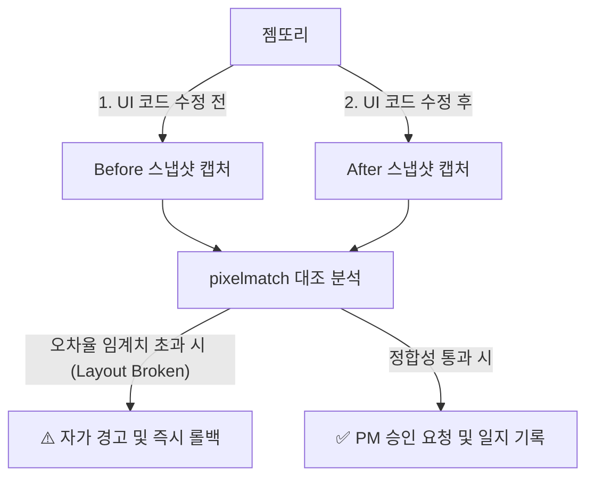

# 🤖 젬또리 전용 비주얼 검증 봇 (Visual Validator)

이 스킬은 젬또리가 웹 프로젝트(React/Styled-components 등)의 CSS, 레이아웃, 박스 모델 관련 소스코드를 수정했을 때, 수정 전(Before)과 수정 후(After)의 렌더링 화면을 픽셀 단위로 대조하여 **시각적 정합성(Visual Regression)을 자가 검증**하기 위해 사용하는 봇 스펙입니다.

---

## 🚦 구동 아키텍처



---

## 🛠️ 실행 및 사용 방법

### 1. 테스트 환경 선행 세팅
비주얼 검증 봇이 동작하기 위해서는 아래 패키지가 프로젝트에 설치되어 있어야 합니다.
```bash
# Playwright 및 이미지 대조(Pixelmatch) 패키지 설치
npm install -D playwright pixelmatch canvas
npx playwright install chromium
```

### 2. 봇 구동 스크립트 실행
*   **명령어**: `node ./.agents/skills/visual-validator/scripts/visual-check.js --url <검증페이지URL> --selector <검증요소>`
*   **예시**: 결제대기 탭의 테이블 정합성을 검사할 경우
    ```bash
    node ./.agents/skills/visual-validator/scripts/visual-check.js --url "http://localhost:3000/admin/orderlist/payment-wait" --selector "#order-table"
    ```

### 3. 검증 결과 분석 및 롤백 가이드
*   스크립트 실행 시 `visual-diff/` 폴더 내에 `before.png`, `after.png`, `diff.png`가 자동 저장됩니다.
*   **오차율(Diff %)이 0.5%를 초과할 경우**: 레이아웃이 무너지거나 정렬이 찌그러진 것으로 판단하여, 에이전트는 작성한 코드를 **즉시 롤백**하고 CSS 정렬을 재설계해야 합니다.
