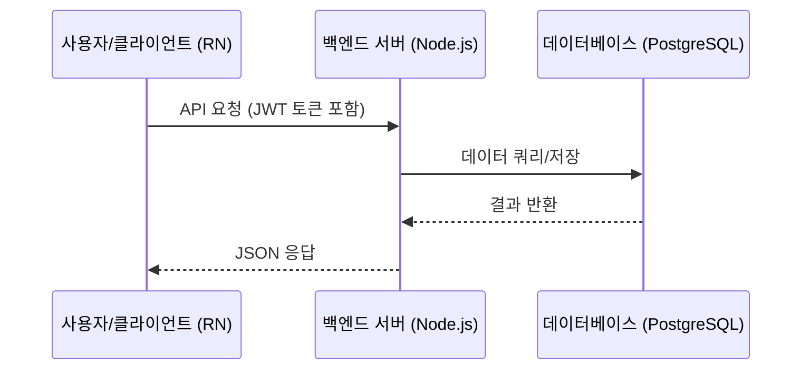

# [기획서/사양서] {기능/프로젝트 이름}

> **상태**: 초안 · **작성자**: {작성자} · **작성일**: {YYYY-MM-DD}
> 사용 후 frontmatter의 `status`/`updated`와 `tags`를 함께 갱신할 것.

---

## 1. 🎯 기능 개요 및 목적
* **해결하려는 문제**: 무엇이 불편하고 무엇을 해결하고자 하는가?
* **목표 (Goal)**: 이 작업이 성공적으로 끝났을 때 달성하고자 하는 결과는 무엇인가?
* **비목표 (Non-Goal)**: 이번 구현 범위에서 의도적으로 제외할 항목은 무엇인가?

---

## 2. 👥 사용자 시나리오 (User Scenario)
* 어떤 사용자가 어떤 흐름으로 이 기능을 사용하는지 1인칭 관점에서 기술합니다.
  1. 사용자가 ...를 터치한다.
  2. ... 화면이 나타나고 ... 데이터가 로딩된다.
  3. 사용자가 ...를 입력하고 저장 버튼을 누른다.

---

## 3. 🏗️ 아키텍처 & 데이터 흐름
* 프론트(React/React Native)와 백엔드 간의 데이터 교환 흐름 및 상태 관리 방식을 간략히 도식화합니다.

---

## 📅 4. 마일스톤 및 일정 (Phase 분할)
* **Phase 1 (MVP)**:
  - 핵심 UI 및 필수 API 엔드포인트 구현 (~{D-day+3})
* **Phase 2 (고도화)**:
  - 예외 처리, 에러 핸들링, 성능 최적화 및 로컬 저장소 캐싱 (~{D-day+7})
* **Phase 3 (배포 및 연동)**:
  - QA 테스트, 실 기기 빌드 검증 및 Slack 연동 (~{D-day+10})

---

## 🔗 5. 관련 노트 (G-Brain 링크)

> 이 스펙이 닿는 지식 노드를 **모듈/계약 단위로 굵게** 연결한다. 함수 단위 링크 금지(CLAUDE.md G1).

* **API 계약(G3)**: 모든 FE↔BE 호출은 [[api-specs]]에 먼저 등록. 관련 앵커 → `[[api-specs#{엔드포인트-id}]]`
* **관련 코드 모듈(G1)**: FE `{src/...}` ↔ BE `{server/...}` (구현 시작 후 채움)
* **관련 회의록/결정**: `[[{회의록 파일명}]]`
* **지식 인덱스**: [[g-brain-map]] 의 프로젝트 노드에 한 행 추가
* **Git 연결(G2)**: 브랜치 `feat/{기능}` · 커밋에 `(ref: {실제 스펙경로}#{앵커})` 기록
