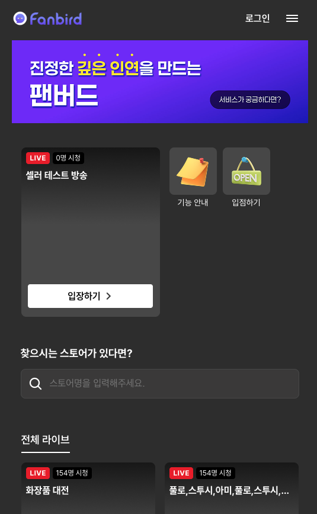
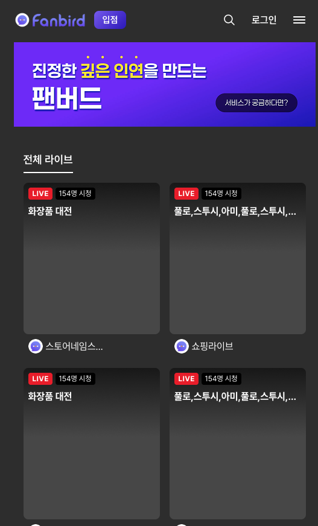

[[Daily]] | → [[260702]]

# 작업일지 — 2026-07-01

## 오늘 한 일

### [[projects/close]] — 홈 UI 개편 & 라이브 탭 수정

**홈 헤더 UI 개편** — `/Users/linkcampus02/close/src/Page/User/Home/Home.tsx`
- 로고 우측 **입점 버튼** 추가 → `/admin/adminsignup` 연결
- 기존 인라인 검색창 제거 → 검색 아이콘 클릭 시 `/search` 이동
- 입점 버튼 스타일: 보라색 그라디언트, `border-radius: 8px`, `padding: 6px 14px`, `font-size: 15px`

**라이브 탭 라벨 변경** — `/Users/linkcampus02/close/src/Page/User/Home/UserLiveList.tsx`
- `공개 라이브` → **전체 라이브**
- `시크릿 라이브` → **찜 라이브** (로그인 시에만 표시, 기존 방식 유지)

**빈 라이브 상태 화면** — `/Users/linkcampus02/close/src/Page/User/Home/UserLiveList.tsx`
- 방송 없을 때: `ic_live_off2.png` 아이콘 + "현재 라이브 중인 방송이 없습니다." 텍스트 중앙 표시

**사이드바 회원탈퇴 메뉴** — `/Users/linkcampus02/close/src/Page/User/Home/Component/SideBar.tsx`
- `isLogin` prop 추가 (Home.tsx에서 전달)
- 로그인 상태일 때만 **회원탈퇴** 메뉴 노출
- 클릭 → confirm 팝업 → `dropUser` API(`DELETE`) 호출 → 성공 시 로그아웃

**스토어 찾기 검색창 X 버튼** — `/Users/linkcampus02/close/src/Page/User/Home/SearchStore.tsx`
- 텍스트 입력 시 우측에 `ic_search_del.png` X 아이콘 노출
- 클릭 시 검색어 초기화(`setText("")`) + 검색 결과 숨김(`setSearchOn(false)`)

**LiveList mockRoute prop 추가** — `/Users/linkcampus02/close/src/Page/User/Home/Component/LiveList.tsx`
- `mockRoute?: string` prop 추가
- 전달 시 로그인 체크·인원 체크 없이 해당 경로로 바로 이동 (목데이터 테스트용)

---

## 기술 검토 / 의사결정

### RN 송출 앱 아키텍처 확정
- AWS는 **송출용 RN SDK 공식 미제공** (시청용 `amazon-ivs-react-native-player`만 공식)
- **Vanilla RN + Native Bridge** (Swift/Kotlin) 방식으로 직접 브릿지 작성 확정
- IVS Broadcast SDK 최신: `1.43.0` (2026-06-04) `[공식/젬또리]`
- Expo Managed → 완전 불가 / Bare → expo-camera 충돌로 이점 없음 → **Expo 기각**
- ⚠️ 주의: 카메라 세션 초기화는 **메인 스레드** 필수, 언마운트 시 `IVSBroadcastSession.release()` 필수

### 스트리밍 프로토콜 정리
- `RTMPS`: 송출자 → IVS 인제스트
- `LHLS`: IVS → 시청자 딜리버리 (2~5초 저지연) → **현 아키텍처 유지**
- IVS Stage(WebRTC) → 3000명 기준 $375/hr, 12명 최적화 → **기각**
- **결론: IVS Low-Latency HLS 유지**

### LiveKit 검토 결과 `[젬또리]`
- 퀴즈/선착순 구매/경매 등 <0.5초 반응 매출 직결 시 권장
- 전환 시: IVS + IVS Chat + Socket.io → LiveKit 하나로 통합, RN Native Bridge 불필요
- 과제: 백엔드 인프라 전환 (LiveKit 서버, Room/토큰 관리) → 백엔드 담당자 협의 필요
- 현 시점에서는 보류

---

## 첨부 / 참고
- 스크린샷: `daily/attachments/`
  - 
  - 
- 상세 보고 전문: 본 문서 하단의 **[1. FE Phase 1 주요 기능 분석 보고 전문]** 및 **[2. RN SDK 연동 견적서 전문]** 참고.

---

## Slack 보고 요약
> 홈 UI 개편(입점버튼·검색창·라벨·회원탈퇴·X버튼·mockRoute) 완료. RN 송출 앱 아키텍처 Vanilla RN + Native Bridge 확정, Expo/WebRTC 기각. IVS Low-Latency HLS 유지 결정.

---
---

# 📑 1. [Close] FE Phase 1 주요 기능 분석 보고 (전문)

> **작성일**: 2026-07-01  
> **대상 항목**: Phase 1 주요 기능 4가지  
> **기준**: 기존 웹 코드(`/Users/linkcampus02/close`) 분석 결과

---

## 1.1. [RN SDK 연동] 라이브 송출 앱

### 현황
- 기존 웹에서 송출·시청·관리 모두 처리 중
- **변경 방향 확정**: 송출만 RN 전용 앱으로 분리, 시청·관리는 웹 유지

### 플랫폼 역할 분리

| 기능 | 플랫폼 | 비고 |
| :--- | :--- | :--- |
| 시청 | 웹 (모바일 브라우저 포함) | 현행 유지 |
| 관리 / 대시보드 | 웹 | 현행 유지 |
| **송출** | **RN 앱 신규** | 판매자 전용 |

### 해야 할 것

| # | 작업 | 비고 |
| :---: | :--- | :--- |
| 1 | RN 프로젝트 생성 및 초기 세팅 | 네비게이션, 기존 API 연동 |
| 2 | iOS Native Bridge 작성 | Swift로 IVS Broadcast SDK 래핑 |
| 3 | Android Native Bridge 작성 | Kotlin으로 IVS Broadcast SDK 래핑 |
| 4 | 송출 화면 구현 | 방송 시작/종료, 카메라 프리뷰 |
| 5 | 카메라·마이크 기기 선택 UI | |
| 6 | 방송 예약 추가/취소, 뱃지, 색감 변경 연동 | |
| 7 | 네트워크 끊김 재연결 처리 | |
| 8 | iOS / Android 실기기 테스트 | |

> **RN 공식 송출 SDK 없음** — AWS는 시청용(`amazon-ivs-react-native-player`)만 공식 지원.  
> 커뮤니티 패키지(`amazon-ivs-react-native-broadcast`)는 2022년 12월 이후 업데이트 없어 현재 RN 버전 호환 불가.  
> **iOS + Android 각각 Native Bridge 직접 작성 필요.**

### 예상 소요 시간

| 구분 | 공수 |
| :--- | :---: |
| RN 프로젝트 초기 세팅 | 1일 |
| Native Bridge (iOS + Android) | 7일 |
| 송출 화면 + 기능 연동 | 2일 |
| 실기기 테스트 및 버그 수정 | 3일 |
| **합계** | **13일 (약 2.5주)** |

### 착수 전 필요 사항

| 항목 | 담당 |
| :--- | :--- |
| AWS IVS 채널 타입 및 스트림 키 테스트 환경 제공 | 백엔드/인프라 |
| iOS 테스트용 실기기 확보 | 팀 |
| Android 테스트용 실기기 확보 | 팀 |
| Apple Developer 계정 (iOS 빌드용) | 팀 |

---

## 1.2. [영상-데이터 싱크] 상품 팝업 싱크 최적화

### 현황 및 문제

현재 상품 팝업이 **영상보다 2~5초 먼저** 노출됨.

```
어드민이 "판매노출" 클릭 (t=0)
  → Socket.io 이벤트 → 팝업 즉시 표시   (t ≈ 0.1초)
  → 영상에서 "이 상품 사세요!" 들림      (t ≈ 2~5초)
```

Low-Latency HLS 영상 레이턴시(2~5초)와 Socket.io 실시간 전달(<0.1초) 간의 갭이 원인.

### 해결 방안 비교

| 구분 | 방법 A — `getLiveLatency()` + setTimeout | 방법 B — IVS Timed Metadata *(권장)* |
| :--- | :--- | :--- |
| 방식 | 플레이어 레이턴시 측정 후 그만큼 delay | 영상 스트림에 메타데이터 삽입, 플레이어에서 수신 |
| 정확도 | 보통 (네트워크 상태에 따라 오차 발생) | 높음 (영상 프레임과 정확히 동기화) |
| 프론트 작업 | `forwardRef`로 `getLiveLatency()` 노출, setTimeout 적용 | `TEXT_METADATA_CUE` 이벤트 핸들러 추가 |
| 백엔드 작업 | 없음 | IVS `PutMetadata` API 엔드포인트 추가 필요 |
| 예상 FE 공수 | 1~2일 | 1~2일 |

> **방법 B 권장**: 레이턴시 변동에 관계없이 영상과 완벽하게 싱크됨.  
> 백엔드팀에 `PutMetadata` API 추가 협의 필요.

### 해야 할 것 (방법 B 기준)

| # | 작업 | 담당 |
| :---: | :--- | :--- |
| 1 | 백엔드에 IVS `PutMetadata` API 엔드포인트 추가 | 백엔드 |
| 2 | 어드민 "판매노출" 클릭 시 `PutMetadata` 호출 연동 | FE |
| 3 | `Live_Component`에 `TEXT_METADATA_CUE` 이벤트 핸들러 추가 | FE |
| 4 | 메타데이터 수신 시 `Live.tsx`로 콜백 전달 → 팝업 표시 | FE |

### 예상 소요 시간

| 구분 | 공수 |
| :--- | :---: |
| FE 작업 (방법 B) | 1~2일 |
| 백엔드 API 추가 | 별도 협의 |

### 필요 사항

| 항목 | 담당 |
| :--- | :--- |
| IVS `PutMetadata` API 엔드포인트 추가 | 백엔드 |
| 방법 A / B 방향 결정 | PM |

---

## 1.3. [실시간 소통] 채팅 및 접속자 수

### 현황

채팅(AWS IVS Chat WebSocket)과 접속자 수(Socket.io) **모두 구현 완료**.

| 기능 | 유저 화면 | 어드민 화면 |
| :--- | :---: | :---: |
| 채팅 수신 (보기) | ✅ | ✅ |
| 채팅 발신 (보내기) | ✅ | ❌ 주석 처리됨 |
| 접속자 수 | ✅ | ✅ |
| 방송 시간 | ✅ | ✅ |
| 재고 실시간 | ✅ | ✅ |

### 잔여 이슈

| 항목 | 내용 | 우선순위 |
| :--- | :--- | :---: |
| 채팅 재연결 없음 | `onclose = () => {}` — 연결 끊겨도 자동 재연결 안 됨 | 높음 |
| 어드민 채팅 발신 비활성 | `Live_Manage.tsx` 입력창 주석 처리 | 확인 필요 |
| 테스트 계정 하드코딩 | `"testY"` 계정이 프로덕션에서 관리자로 표시됨 | 중간 |
| 메시지 무제한 누적 | 장시간 방송 시 메모리 누수 가능성 | 낮음 |

### 해야 할 것

| # | 작업 | 공수 |
| :---: | :--- | :---: |
| 1 | `onclose` 재연결 로직 추가 (exponential backoff) | 0.5일 |
| 2 | 어드민 채팅 발신 활성화 여부 결정 후 처리 | 0.5일 |
| 3 | 테스트 계정 `"testY"` 제거 | 0.5일 |
| | **합계** | **1~1.5일** |

### 필요 사항

| 항목 | 담당 |
| :--- | :--- |
| 어드민 채팅 발신 기능 활성화 여부 결정 | PM |
| 하드코딩 어드민 ID 목록 최종 확정 (API 기반 전환 여부) | PM / 백엔드 |

---

## 1.4. [어드민 기능 제어] 상품/스토어 실시간 제어

### 기능별 구현 상태

| 기능 | 상태 | 비고 |
| :--- | :---: | :--- |
| 가격 수정 | ✅ 구현됨 | 단, "대기" 상태일 때만 가능 |
| 재고 수정 | ✅ 구현됨 | 단, "대기" 상태일 때만 가능 |
| 상품 노출 상태 변경 (대기/판매/판매노출) | ✅ 구현됨 | 즉시 반영 |
| **노출 순서 변경 (Drag & Drop)** | ❌ 미구현 | 라이브러리 및 로직 없음 |
| **스토어 ON/OFF** | ❌ 미구현 | UI/API 모두 없음 |
| 구매취소 ON/OFF | ⚠️ 주석 처리 | API 확인 후 주석 해제 가능 |

### 주요 이슈

**가격/재고 방송 중 수정 제약**  
현재 `product_status === "대기"` 일 때만 수정 가능. 명세 상 "방송 중 실시간 수정"이 목표이므로 **판매노출 상태에서도 수정 허용할지 정책 확인 필요**.

**노출 순서 변경 — 완전 신규 구현**  
`product_num` 컬럼은 존재하나 Drag & Drop UI 및 순서 저장 API 연동 없음.

**스토어 ON/OFF — 완전 신규 구현**  
`store_update` API는 있으나 ON/OFF 토글 필드(`store_status` 등) 및 UI 없음.

### 해야 할 것 & 예상 공수

| # | 작업 | 공수 | 백엔드 확인 |
| :---: | :--- | :---: | :---: |
| 1 | 상품 노출 순서 Drag & Drop 구현 | 2~3일 | 순서 저장 API 여부 |
| 2 | 스토어 ON/OFF 토글 UI + API 연동 | 0.5일 | `store_status` 필드 + API |
| 3 | 구매취소 ON/OFF 주석 해제 | 0.5일 | API 준비 여부 |
| 4 | 판매노출 중 가격/재고 수정 허용 처리 | 0.5~1일 | 정책 확인 후 |
| | **합계** | **3.5~5일** | |

### 필요 사항

| 항목 | 담당 |
| :--- | :--- |
| 판매노출 중 가격/재고 실시간 수정 허용 여부 (정책) | PM |
| 상품 노출 순서 저장 API 존재 여부 | 백엔드 |
| `store_status` 필드 + ON/OFF API 존재 여부 | 백엔드 |
| 구매취소 ON/OFF API 준비 여부 | 백엔드 |

---

## 1.5. 전체 요약

| 항목 | 예상 공수 | 백엔드 협의 필요 | 착수 전 준비 |
| :--- | :---: | :---: | :--- |
| RN SDK 연동 | **13일** | 스트림 키 테스트 환경 | 실기기, Apple Dev 계정 |
| 영상-데이터 싱크 | **1~2일** | PutMetadata API (방법 B 시) | 방향 결정 |
| 실시간 소통 | **1~1.5일** | 어드민 채팅 발신 여부 | — |
| 어드민 기능 제어 | **3.5~5일** | 순서 API, 스토어 ON/OFF, 구매취소 | 정책 결정 |
| **합계** | **약 19~21일** | | |

---
---

# 📑 2. [Close] RN SDK 연동 견적서 (전문)

> **기준**: 프론트엔드 개발자 1인 / 영업일 기준  
> **범위 확정**: IVS 방송 송출 RN 전용 앱 신규 개발  
> **제외**: 시청 플레이어 RN 연동 없음 (시청은 웹·모바일 브라우저 유지)  
> **작성일**: 2026-07-01

---

## 2.1. 아키텍처 확정 사항 [젬또리 2026-07-01]

| 항목 | 결정 | 근거 |
| :--- | :--- | :--- |
| 스트리밍 방식 | **Low-Latency HLS 유지** | Stage(WebRTC) 전환 불필요 — 소통감 목적에 2~5초 충분, 비용 대비 효과 없음 |
| 시청자 레이턴시 | 2~5초 | 쿠팡라이브·카카오쇼핑라이브 동일 수준 |
| RN 커뮤니티 패키지 | **사용 불가** | `amazon-ivs-react-native-broadcast`: apiko-dev 비공식, 2022-12 이후 업데이트 없음, Stage 미지원, 현 RN 버전 호환 불가 |
| RN 구현 경로 | **Native Bridge 직접 작성** | 공식 RN 송출 SDK 없음 (AWS는 `amazon-ivs-react-native-player` 시청 전용만 공식 지원) |

### 향후 WebRTC 도입 계획 [PM 2026-07-02]

현재는 RTMP(Low-Latency HLS) 유지로 확정하되, **고부가가치 VIP 실시간 경매 기능**처럼 초저지연(서브초 단위)·양방향 상호작용이 필요한 기능이 도입될 때 해당 기능에 한해 WebRTC(IVS Stage)를 별도 적용하는 방향으로 검토 중. 현재 송출 앱(RN Native Bridge) 설계에는 영향 없음 — 추후 별도 스코프로 분리.

---

## 2.2. 최종 견적

| 구분 | 공수 |
| :--- | :---: |
| RN 프로젝트 초기 세팅 | 1일 |
| Native Bridge 송출 구현 | 12일 |
| **합계** | **13일 (약 2.5주)** |

---

## 2.3. 세부 공수

### 공통 — RN 프로젝트 초기 세팅 | 1일

| # | 작업 항목 | 공수 |
| :---: | :--- | :---: |
| 0-1 | RN 프로젝트 생성, 기본 폴더 구조, 네비게이션 세팅 | 0.5일 |
| 0-2 | 기존 웹 axios / API URL 연동 (`server.jsx` 재활용) | 0.5일 |

---

### Native Bridge — iOS + Android | 12일

| # | 작업 항목 | 공수 |
| :---: | :--- | :---: |
| B-1 | iOS: Swift로 IVS Broadcast SDK 연동 + RN Native Module 래핑 | 3.5일 |
| B-2 | Android: Kotlin으로 IVS Broadcast SDK 연동 + Native Module 래핑 | 3.5일 |
| B-3 | 카메라·마이크 기기 선택 UI 연동 | 0.5일 |
| B-4 | 방송 예약 추가/취소, 뱃지, 색감 변경 기능 연동 | 1일 |
| B-5 | 네트워크 끊김 감지 및 재연결 처리 | 0.5일 |
| B-6 | iOS / Android 실기기 테스트 및 버그 수정 | 3일 |
| | **소계** | **12일** |

---

## 2.4. 송출 앱 기능 범위 (확정)

| 기능 | 포함 여부 |
| :--- | :---: |
| 방송 송출 시작 / 종료 | ✅ |
| 카메라 · 마이크 기기 선택 | ✅ |
| 방송 예약 추가 / 취소 | ✅ |
| 라이브 뱃지 설정 | ✅ |
| 판매창 색감 변경 | ✅ |
| 상품 관리 (등록/수정/재고) | ❌ 웹 대시보드 전담 |
| 시청자용 플레이어 | ❌ 웹(모바일 브라우저) 유지 |

---

## 2.5. 전제 조건 (착수 전 확인 필요)

| 항목 | 상태 |
| :--- | :---: |
| AWS IVS 채널 타입 / 스트림 키 테스트 환경 | ❓ 백엔드팀 확인 필요 |
| iOS 실기기 (테스트용) 확보 | ❓ |
| Android 실기기 확보 | ❓ |
| Apple Developer 계정 (iOS 빌드용) | ❓ |

> 실기기 없으면 카메라/마이크 송출 테스트 불가 (시뮬레이터 미지원)
