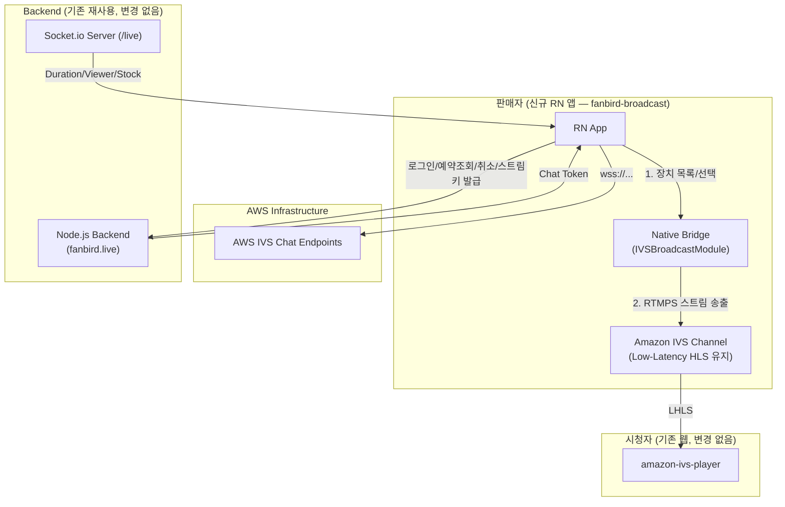
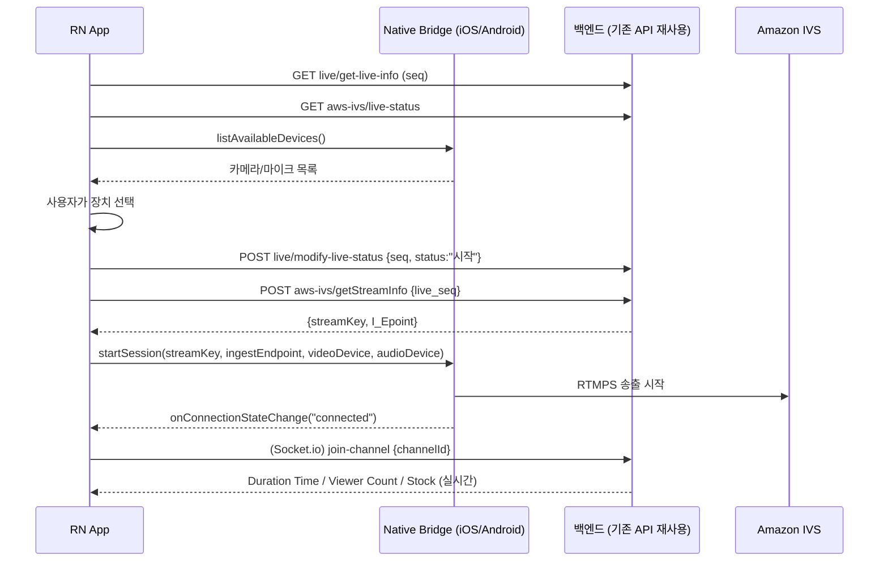

# [기술설계서] fanbird 라이브 송출 RN 앱

> **상태**: 초안 · **작성자**: PM · 클또리(정리) · **작성일**: 2026-07-02
> 근거 문서: `Docs/작업일지/260701/FE_회의보고_Phase1_실시간기능.md`, `Docs/작업일지/260701/RN_SDK_견적서.md`, 웹 코드(`close/src/Page/Manage/LiveManage/*`), 디자인 목업(`Docs/디자인/RN/*`)

---

## 1. 🎯 기능 개요 및 목적

* **해결하려는 문제**: 현재 판매자 송출은 웹 브라우저(`amazon-ivs-web-broadcast`, RTMPS)로 처리 중. 모바일 브라우저는 백그라운드 전환 시 스트림이 끊기고, 카메라/마이크 권한이 불안정하며, 장시간 방송 시 배터리·발열 이슈가 큼. 판매자가 실제로 방송을 켜는 환경은 대부분 모바일이라 **네이티브 앱 분리**가 필요.
* **목표 (Goal)**: 판매자 전용 React Native 송출 앱을 신규 개발한다.
  - 방송 시작/종료, 카메라·마이크 선택
  - 예약된 방송 목록 조회 및 **취소**(신규 생성 폼은 웹 전용으로 남김)
  - 뱃지 설정, 판매창 색감 변경(신규 기능, 목업 없음 — Phase 2)
  - 네트워크 끊김 감지 및 재연결
* **비목표 (Non-Goal)**:
  - 시청자용 플레이어 (웹/모바일 브라우저 유지)
  - 상품 등록/수정/재고 관리 (웹 대시보드 전담)
  - 방송 예약 **신규 생성** 폼 (웹 `LiveMake.tsx` 그대로 유지, RN은 취소만)
  - WebRTC/IVS Stage 전환 — 별도 결정사항([[close#향후-webrtc-도입-계획]] 참조, VIP 실시간 경매 기능 도입 시로 분리)

---

## 2. 👥 사용자 시나리오 (User Scenario)

1. 판매자가 fanbird 송출 앱을 열고 로그인한다 (기존 `seller-login` API 재사용).
2. **라이브 목록** 화면에서 예약된 방송 카드를 본다 (예약일시/제목/시간/수용인원/상태).
3. 예약을 취소하려면 **취소** 버튼을 누른다 (`live/live-cancel`).
4. 예약 시간이 된 방송의 **라이브 송출** 버튼을 누르면 송출 화면으로 진입한다.
5. **장치 선택** 화면에서 카메라·마이크를 드롭다운으로 선택한다. 선택 전엔 "라이브 시작" 버튼이 비활성(회색) 상태.
6. 장치 선택 완료 후 "라이브 시작"을 누르면 방송이 시작되고, 카메라 프리뷰 + 실시간 타이머 + 시청자 수 + 채팅 + 판매상품 팝업이 화면에 나타난다.
7. 방송 중 네트워크가 순단되면 앱이 자동으로 재연결을 시도하고, 상태를 화면에 표시한다.
8. "라이브 종료"를 누르면 송출이 멈추고 목록 화면으로 돌아간다.

---

## 3. 🏗️ 아키텍처 & 데이터 흐름

### 3.1 리포지토리 구성

| 구분 | 경로 | 비고 |
| :--- | :--- | :--- |
| 기존 웹(시청/관리) | `/Users/linkcampus02/close` | 변경 없음, 계속 운영 |
| **신규 RN 송출 앱** | **`/Users/linkcampus02/fanbird-broadcast`** | 신규 레포. `close`와 완전 분리 (다른 스택·배포 파이프라인) |
| biz-ttori 문서 허브 | `projects/close/` (폴더명 유지, 서비스명은 fanbird로 통칭) | 코드 없음, 컨텍스트/설계서만 |

### 3.2 전체 시스템 흐름



### 3.3 방송 시작 시퀀스



---

## 4. 📱 화면별 상세 설계

목업 근거: `Docs/디자인/RN/*.png`

### 4.1 로그인 화면 (`모바일 어드민 로그인.png`)
| 항목 | 내용 |
| :--- | :--- |
| API | `user/seller-login` (기존 재사용) |
| 토큰 저장 | 웹은 localStorage → RN은 **AsyncStorage** (현재 Keychain 패키지는 미설치로, AsyncStorage 단독 관리로 확정) |
| 인터셉터 | 웹 `axios_Interceptor/api.tsx` 로직(만료 시 `user/refresh`) 그대로 포팅 |

### 4.2 라이브 목록 화면 (`모바일 어드민 라이브 목록_예약.png`)
| 항목 | 내용 |
| :--- | :--- |
| 표시 정보 | 예약일시, 라이브 제목, 라이브 시간, 수용인원, 라이브 상태 |
| 액션 | **취소** (`live/live-cancel`) / **라이브 송출** (예약 상태 → 송출 화면 진입) |
| 비고 | 신규 예약 생성 폼 없음 — 웹 `LiveMake.tsx`에서만 생성 가능 |

### 4.3 라이브 송출 화면 — 방송 전 (`라이브 화면_장치선택.png`)
| 항목 | 내용 |
| :--- | :--- |
| 장치 선택 | 카메라/마이크 드롭다운. Native `listAvailableDevices()` 결과 바인딩 |
| 라이브 시작 버튼 | 장치 미선택 시 비활성(회색), 선택 완료 시 활성(보라 그라데이션) — 웹 `Start_Btn` 스타일 로직과 동일 |
| 예약 시간 검증 | 웹 `Live_Start()`의 `live_start`/`live_finish` 시간 비교 로직 그대로 포팅 |

### 4.4 라이브 송출 화면 — 방송 중 (`라이브 화면.png`)
| 항목 | 내용 |
| :--- | :--- |
| 카메라 프리뷰 | Native View 컴포넌트로 노출 (iOS `IVSImagePreviewView`, Android `ImageDevice.getPreviewView()`) |
| 타이머/시청자 수 | Socket.io `Duration Time` / `Viewer Count` 이벤트 (웹과 동일 서버, 로직 그대로) |
| 채팅 | AWS IVS Chat WebSocket — 웹 `ChatComponent.tsx` 로직을 RN용으로 포팅 필요 |
| 판매상품 팝업 | Socket.io `Stock`/`Stock Over` 이벤트로 노출 (웹 `Live_Manage.tsx`의 `data.product_status === "판매노출"` 조건 동일) |
| 공지사항 | `live/get-live-notice` 등 기존 API 재사용 |
| 소리설정 | 클라이언트 로컬 상태 (볼륨/음소거) — 신규 UI, API 불필요 추정 |
| **뱃지 설정** | ⚠️ **신규 기능, 목업 없음.** 별도 기획 확정 필요 (Phase 2로 분리 제안) |
| **판매창 색감 변경** | ⚠️ **신규 기능, 목업 없음.** 별도 기획 확정 필요 (Phase 2로 분리 제안) |
| 라이브 종료 | `live/modify-live-status {status:"종료"}` + `Native.stopSession()` |

---

## 5. 🔧 Native Bridge 설계

### 5.1 SDK 확정 사항 [젬또리 리서치, 2026-07-02]

| 항목 | 내용 |
| :--- | :--- |
| iOS SDK | **AmazonIVSBroadcast** v1.43.0 (2026-06-04 업데이트) — CocoaPods 배포 중단(1.39.0~), vendored xcframework 방식 |
| Android SDK | **Amazon IVS Broadcast SDK for Android** (`com.amazonaws:ivs-broadcast:1.43.0`) — Maven/Gradle 공식 지원 (RTMPS 송출은 순수 아티팩트 사용, :stages@aar 접미사는 WebRTC 전용이므로 제외) |
| RN 공식 브릿지 | 없음. `amazon-ivs-react-native-player`(시청 전용)만 공식 배포 |
| 참고 자료 | 커뮤니티 래퍼 [apiko-dev/amazon-ivs-react-native-broadcast](https://github.com/apiko-dev/amazon-ivs-react-native-broadcast) 구조 벤치마킹, AWS 공식 네이티브 샘플([aws-samples/amazon-ivs-broadcast-android-sample](https://github.com/aws-samples/amazon-ivs-broadcast-android-sample) 등) 기준으로 브릿지 메서드 설계 |

> 커뮤니티 RN 패키지는 못 쓰지만(2022-12 이후 미업데이트, 현재 RN 버전 비호환), **밑단 네이티브 SDK 자체는 AWS가 지난달(2026-06-04)까지 공식 최신 유지**하고 있어 Native Bridge 직접 작성 방향의 리스크는 낮음.

### 5.2 네이티브 SDK 기본 제공 기능 (직접 구현 불필요)

| 기능 | 제공 방식 |
| :--- | :--- |
| 카메라 프리뷰 | `IVSImagePreviewView`(iOS) / `device.getPreviewView()` (Android 인스턴스 뷰 획득) |
| 장치 목록/전환 | `BroadcastSession.listAvailableDevices()`, `session.exchangeOldDevice(old, withNewDevice, callback)` |
| 자동 재연결 | SDK 내장 — `IVSBroadcastSession.Delegate`(iOS) / 세션 리스너(Android)로 `connected`/`disconnected`/`reconnecting` 상태만 수신해 **UI 갱신**하면 됨. 재연결 로직 자체를 직접 구현할 필요 없음 |

### 5.3 RN Native Module 인터페이스 (초안)

```ts
// IVSBroadcastModule — JS 측 인터페이스 초안
interface IVSBroadcastModule {
  listAvailableDevices(): Promise<{ video: DeviceInfo[]; audio: DeviceInfo[] }>;
  startSession(params: {
    streamKey: string;
    ingestEndpoint: string;
    videoDeviceId: string;
    audioDeviceId: string;
  }): Promise<void>;
  stopSession(): Promise<void>;
  exchangeDevice(oldDeviceId: string, newDeviceId: string): Promise<void>;

  // 이벤트 (NativeEventEmitter)
  // onConnectionStateChange: "connected" | "disconnected" | "reconnecting"
  // onError: { code: string; message: string }
}
```

세부 파라미터/에러 코드 체계는 iOS/Android 실제 착수 시 SDK delegate 콜백 시그니처에 맞춰 확정.

---

## 6. ⚠️ 백그라운드 / 화면 잠금 대응

**정책(PM 확정)**: 방송 중 앱 백그라운드 전환·화면 잠금 시에도 송출을 **유지하는 방향**으로 간다.

> **플랫폼별 실현 가능성이 다르므로 아래 제약을 명확히 인지하고 진행할 것.**

| 플랫폼 | 실현 가능성 | 방식 |
| :--- | :--- | :--- |
| **Android** | ✅ 가능 | Foreground Service + `foregroundServiceType="camera\|microphone"` (Android 10+ 필수), 방송 중임을 알리는 지속 알림(Notification) 필요 |
| **iOS** | ⚠️ **제약 큼** | iOS는 앱이 백그라운드로 가면 **카메라 캡처가 OS 레벨에서 강제 중단**됨 (일반 앱 권한으로는 우회 불가). 화면 잠금까지만 막는 정도가 현실적 1차 대응: `UIApplication.shared.isIdleTimerDisabled = true`로 방송 중 **자동 화면 잠금 방지**. 완전한 백그라운드 영상 송출 유지는 별도 Broadcast Extension 등 훨씬 큰 작업이 필요하며 이번 스코프에 포함하지 않음 |

**결론**: Android는 "백그라운드에서도 유지" 구현 가능. iOS는 "화면은 켜진 채 유지(자동 잠금만 방지)"까지가 현실적 1차 목표이고, 완전한 백그라운드 유지는 후속 검토 항목으로 별도 분리 필요. **이 제약을 PM/판매자에게 사전 안내 권장.**

---

## 📅 7. 마일스톤 및 일정 (Phase 분할)

기존 견적(`RN_SDK_견적서.md`, 13일)에 이번에 확정된 스코프(예약=취소만, 뱃지/색감=신규/Phase2 분리)를 반영해 재구성.

* **Phase 1 (MVP, 기존 견적 범위)** — 약 13일
  - RN 프로젝트 초기 세팅 (1일)
  - Native Bridge: iOS/Android 각 3.5일 + 장치 선택 UI 0.5일 + 재연결 처리 0.5일 (기존 견적 유지 — SDK 자체 재연결 API 활용 확인됨)
  - 방송 시작/종료, 라이브 목록(조회+취소), 로그인
  - Android 백그라운드 유지(Foreground Service) 포함
  - 실기기 테스트 3일
* **Phase 2 (신규 기능 — 별도 견적 필요)**
  - 뱃지 설정, 판매창 색감 변경 (기획 확정 후 공수 산정)
  - iOS 백그라운드 유지 심화 검토 (Broadcast Extension 등, 필요 시)
* **Phase 3 (배포/연동)**
  - QA, 실기기 빌드 검증, Apple Developer 계정 필요

**착수 전 필요 사항 (기존과 동일, 아직 미확보 — PM 확인: "프론트 정리 먼저, 이후 진행")**
- AWS IVS 스트림키 테스트 환경
- iOS/Android 실기기, Apple Developer 계정

---

## 🔗 8. 관련 노트 (G-Brain 링크)

* **API 계약(G3)**: 이 앱이 쓰는 모든 엔드포인트는 기존 웹과 100% 공유 — 신규 계약 없음. 참조: `close/src/Component/server.jsx` (live, aws-ivs, product, user 네임스페이스)
* **관련 코드 모듈(G1)**: 웹 참조 구현 — `close/src/Page/Manage/LiveManage/AdminLive.tsx`(송출 코어), `close/src/Page/Manage/LiveManage/Live_Manage.tsx`(화면/소켓). 신규 RN 코드는 착수 후 `/Users/linkcampus02/fanbird-broadcast` 경로에 생성.
* **관련 결정 문서**: [[260701]] 일지 내 통합 수립된 견적서 및 회의록 전문 (아키텍처 확정 + 향후 WebRTC 계획 등)
* **디자인 목업**: `Docs/디자인/RN/*.png`
* **지식 인덱스**: [[g-brain-map]] 업데이트 필요 (fanbird-broadcast 신규 레포 노드 추가)
