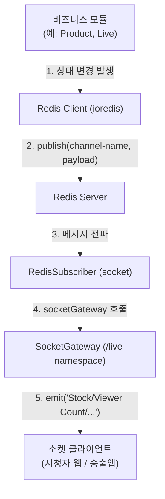

# 🖥️ fanbird-backend 백엔드 소스 코드 검토 보고서

`../fanbird-backend` 리포지토리의 소스 코드를 분석하여 모바일 송출앱(fanbird-broadcast)의 연동 요구 사항과 설계 상의 블로커 및 연동 규칙을 검토했습니다.

---

## 1. 🌐 RTMPS Ingest URL 구조 검증

* **현황 및 분석**:
  - `aws-ivs.service.ts`의 `getStreamInfo`는 환경 변수에서 `${live.channel_name}_E_POINT` 값을 읽어 `I_Epoint`로 반환합니다.
  - `.env.test` 상에 정의된 `E_POINT`들의 실제 포맷을 검토한 결과:
    `rtmps://c26f48c45345.global-contribute.live-video.net:443/app/` 와 같이 **프로토콜 스키마(`rtmps://`), 포트 번호(`:443`), 경로 접미사(`/app/`)까지 전부 포함된 완전한 RTMPS URL 형태**로 보관 및 반환되고 있습니다.
* **연동 가이드**:
  - 모바일 앱(RN Native Bridge) 측에서는 백엔드가 리턴하는 `I_Epoint` 문자열 뒤에 중복으로 포트나 스키마를 강제 조립하지 않고, **받아온 `I_Epoint` 값 그대로를 Ingest URL로 매핑**하여 사용해야 오류가 발생하지 않습니다.

---

## 2. 🔐 사용자 로그인 및 'master' 권한 흐름 검증

* **현황 및 분석**:
  - `user.service.ts`의 `sellerJoin` 시, 판매자 유저는 `user_level`이 `'master'`로 생성됩니다.
  - 판매자 로그인 API(`/user/seller-login`)가 성공할 경우, JWT 토큰 페이로드 상에 `user_level: user.user_level` 정보가 저장 및 발급됩니다.
  - `aws-ivs.service.ts`의 `getStreamInfo` 메서드는 API 요청자의 JWT 토큰 상 **`user_level`이 `'master'`인 경우에만 환경 변수에서 `streamKey`를 정상적으로 읽어와 프론트에 응답**합니다.
* **연동 가이드**:
  - 모바일 송출앱에서 `seller-login` API를 통해 발급받은 토큰을 헤더에 정상적으로 얹어 요청하면 권한 검증에 통과하여 방송 송출을 위한 `streamKey`를 누락 없이 획득할 수 있습니다.

---

## 3. ⏱️ 실시간 상품 노출 싱크 및 AWS Timed Metadata (A안) 분석

* **현황 및 분석**:
  - 일지에서 결정했던 0.1초 미만 오차의 **Timed Metadata 방식(A안)** 구현 상태를 검토했으나, 현재 백엔드 코드(`aws-ivs` 모듈 및 `product` 모듈) 내에 **AWS SDK의 `PutMetadata` 관련 API 호출 로직은 전혀 구현되어 있지 않습니다.**
  - **현재 구현 구조**:
    1. `product.service.ts`에서 상품 상태 수정(`판매노출`) 시 Redis Pub/Sub 채널 `send-stock-event`에 노출 상품 정보를 발행합니다.
    2. 소켓 서버의 `RedisSubscriber`가 이를 구독하여 `SocketGateway`를 호출하고,
    3. `/live` 네임스페이스 하위의 해당 채널 룸(`channel:${channelId}`)으로 웹소켓 메시지(`Stock` 및 `Stock Over` 이벤트)를 브로드캐스팅하는 **소켓 기반 구조(B안)**만 구축되어 있습니다.
* **연동 가이드**:
  - 영상 프레임과 완벽히 동기화된 상품 팝업 노출(A안)을 구현하려면, 백엔드 측의 상품 노출 변경 API 흐름 내에 **AWS IVS의 `PutMetadataCommand`를 실행하여 비디오 메타데이터를 직접 주입해 주는 백엔드 보완 작업이 선행**되어야 합니다.

---

## 4. 💬 IVS Chat 기반 채팅 고도화 속성 분석

* **현황 및 분석**:
  - `aws-ivs-chat2.service.ts`의 `sendMessage` 메서드는 서버 내에서 메시지를 보낼 때 아래와 같은 메시지 오브젝트 규격을 따릅니다.
    ```json
    {
      "Action": "SEND_MESSAGE",
      "content": "메시지내용",
      "Attributes": {
        "type": "상태값(예: notice 등)"
      }
    }
    ```
* **연동 가이드**:
  - 모바일 송출앱의 `ChatPanel` 및 클라이언트 측에서는 수신되는 Chat 메시지 속성 중 `Attributes.type` 또는 `type` 메타데이터 속성을 활용하여 **공지사항 상단 고정 노출, 일반 시청자 채팅 숨김(음소거), 매크로 프리셋 표시** 등을 정밀하게 구분 처리할 수 있습니다.

---

## 5. 📅 라이브 상태 제어 및 예약 취소 프로세스

* **방송 시작/종료 연동**:
  - `/live/modify-live-status` POST API: 방송을 시작할 때 `'시작'` 상태를 전달받아 DB 내 `start_dt`를 `NOW()`로 갱신하고 `live_status`를 `방송중`으로 변경하여, 송출이 시작된 실시간 타임스탬프를 안전하게 동기화합니다.
* **예약 취소 연동**:
  - `/live/live-cancel` POST API: 예약된 라이브를 정상 취소하고, DB 트랜잭션을 통해 해당 라이브를 생성할 때 사용했던 코인을 안전하게 환불하는 금융/사용 이력 관리를 지원합니다. (역시 `'master'` 권한이 요청 헤더에 요구됩니다.)

---

## 🛠️ 6. fanbird-backend 기술 스택 정리 (2026년 7월 기준)

### 6.1 프레임워크 및 언어 사양
- **프레임워크**: NestJS v10.0.0 (`@nestjs/common`, `@nestjs/core`, `@nestjs/platform-express` 등)
- **언어**: TypeScript v5.1.3 (실행 요구 사양: Node.js >= v22.11)

### 6.2 데이터베이스 및 데이터 관리
- **ORM**: TypeORM v0.3.23 (`@nestjs/typeorm` v11.0.0 연동)
- **데이터베이스 드라이버**: MySQL/MariaDB (`mysql2` v3.14.1 드라이버 라이브러리 사용)

### 6.3 실시간 웹소켓 및 Pub/Sub 엔진
- **소켓 엔진**: Socket.io v4.8.1 (`@nestjs/platform-socket.io` & `@nestjs/websockets` v10.4.17 연동)
- **메시지 중계 및 Redis 어댑터**: Redis Pub/Sub (`ioredis` v5.6.1), `@socket.io/redis-adapter` v8.3.0

### 6.4 AWS 인프라 및 클라우드 연동
- **AWS SDK v3**: `@aws-sdk/client-ivs` v3.826.0, `@aws-sdk/client-ivschat` v3.812.0
- **AWS SDK v2 (Legacy)**: `aws-sdk` v2.1692.0 (채팅 토큰 생성 등에 구버전 SDK가 혼용되어 사용됨)

### 6.5 인증 및 암호화
- **JWT 및 Passport**: `passport` v0.7.0, `passport-jwt` v4.0.1, `@nestjs/jwt` v11.0.0, `@nestjs/passport` v11.0.5
- **비밀번호 단방향 해싱 암호화**: `bcryptjs` v3.0.2

### 6.6 기타 핵심 모듈
- **알림톡 전송**: `aligoapi` v1.1.3
- **날짜 및 시간**: `dayjs` v1.11.13, `moment-timezone` v0.5.48
- **비동기 이벤트 분배**: `eventemitter2` v6.4.9
- **엑셀 및 파일 가공**: `xlsx` v0.18.5, `multer` v1.4.5-lts.2

---

## 🏛️ 7. 백엔드 시스템 구조 및 데이터 흐름

### 7.1 도메인별 모듈러 모놀리스 (Modular Monolith) 구조
- 백엔드 내부의 각 도메인은 독립적으로 모듈화되어 있으며, 각 폴더(예: `user`, `live`, `product`, `aws-ivs`, `socket`) 내에서 `Controller` ➡️ `Service` ➡️ `Entity` ➡️ `Module` 순으로 연결되는 NestJS 표준 계층형 구조를 따릅니다.

### 7.2 Redis Pub/Sub 기반 실시간 브로드캐스트 아키텍처
- 백엔드는 클라이언트의 다중 분산 접속 환경 및 소켓 오버헤드 경감을 위해 **Redis Pub/Sub을 사용한 분리형 실시간 전송 흐름**을 갖추고 있습니다:



1. **상태 변경**: 판매 노출 상품 변경(`product.service.ts`)이나 시청자 수 집계 등의 비즈니스 로직이 일어나면 백엔드 내부에서 Redis로 이벤트를 퍼블리시합니다.
2. **이벤트 수집**: 소켓 모듈 내 [redis_subscriber.ts](file:///Users/linkcampus02/fanbird-backend/src/socket/redis_subscriber.ts)의 `RedisSubscriber`가 모듈 시작 시점에 Redis 채널들을 일괄 구독(`subscribe`)하고 대기합니다.
3. **소켓 전송**: Redis로부터 메시지를 수신하는 즉시 [socket.gateway.ts](file:///Users/linkcampus02/fanbird-backend/src/socket/socket.gateway.ts)의 `SocketGateway`를 호출하여, 해당 채널 룸(`channel:${channelId}`)에 조인해 있는 모바일 송출앱 및 웹 클라이언트들에 소켓 이벤트를 다이렉트로 전달합니다.
