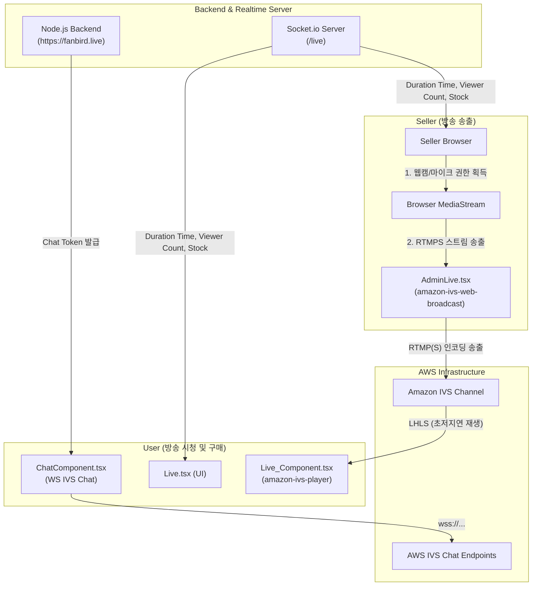

← [[projects/README|projects]]

# 🎬 close (fanbird live) 프로젝트 분석 보고서

## 문서 목록
- [[Docs/FE_작업명세_분석]]
- [[Docs/어웨이크 연동 작업 V1 명세서]]
- [[Docs/팬버드 라이브커머스 페이즈별 직군 작업 명세서]]
- [[Docs/송출앱_기술설계서]] — RN 송출 앱 기술설계서 (신규 레포: `/Users/linkcampus02/fanbird-broadcast`)
- [[Docs/작업일지/memo]]

---

이 문서는 `/Users/linkcampus02/close` 경로에 위치한 라이브 커머스(실시간 쇼핑) 웹 애플리케이션 프로젝트의 기술 스택, 시스템 아키텍처, 주요 기능 흐름 및 레이턴시 특성을 분석하고 정리한 보고서입니다.

---

## 1. 🛠 기술 스택 (Technology Stack)

| 구분 | 기술 / 라이브러리 | 버전 | 주요 용도 |
| :--- | :--- | :--- | :--- |
| **Core** | React | `^19.1.0` | 사용자 UI 프레임워크 |
| | TypeScript | `^4.9.5` | 정적 타입 시스템 제공 |
| | React Router DOM | `^7.6.0` | 페이지 라우팅 관리 |
| **Styling** | styled-components | `^6.1.18` | 컴포넌트 단위 CSS 스타일링 |
| **Streaming** | amazon-ivs-player | `^1.40.0` | 시청자 화면의 실시간 영상 재생 (HLS) |
| | amazon-ivs-web-broadcast | `1.16.0` | 판매자 화면의 카메라/마이크 영상 송출 (RTMPS) |
| **Real-time** | socket.io-client | `^4.8.1` | 실시간 시청자 수, 방송 시간, 상품 재고 동기화 |
| **HTTP Client** | axios | `^1.9.0` | 백엔드 API 요청 및 JWT 토큰 처리 |
| **Chart** | chart.js / react-chartjs-2 | `^4.4.9` | 대시보드 내 매출 및 주문 통계 시각화 |

---

## 2. 🏗 시스템 아키텍처 (System Architecture)

프로젝트는 **Amazon IVS**와 **웹소켓(Socket.io)** 서버를 중심으로 실시간 비디오 및 상태 동기화가 맞물려 작동합니다.



---

## 3. 📂 주요 디렉토리 및 소스코드 맵핑

전체 프로젝트 엔트리 포인트는 [App.tsx](file:///Users/linkcampus02/close/src/App.tsx)이며, 다음과 같이 사용자(User) 뷰와 관리자(Manage) 뷰로 구분됩니다.

### 👥 사용자 관련 파일 (`src/Page/User`)

| 기능 및 화면 | 파일 경로 | 주요 역할 및 특징 |
| :--- | :--- | :--- |
| **메인 홈** | [Home.tsx](file:///Users/linkcampus02/close/src/Page/User/Home/Home.tsx) | 진행 중인 라이브 방송 목록 나열, 검색 및 로그인 연동 |
| **라이브 시청** | [Live.tsx](file:///Users/linkcampus02/close/src/Page/User/Live/Live.tsx) | 방송 재생 레이아웃, 실시간 채팅, 노출 상품 구매 모달 연동 |
| **비디오 재생** | [Live_Component.tsx](file:///Users/linkcampus02/close/src/Page/User/Live/Live_Component.tsx) | `amazon-ivs-player` 기반 영상 재생, 버퍼링 감지, 음소거 해제 관리 |
| **주문/결제** | [User_Bill.tsx](file:///Users/linkcampus02/close/src/Page/User/Bill/User_Bill.tsx) | 라이브 중 구매 버튼 클릭 시 연결되는 유저 주문 정보 확인창 |

### 👑 관리자 / 판매자 관련 파일 (`src/Page/Manage`)

| 기능 및 화면 | 파일 경로 | 주요 역할 및 특징 |
| :--- | :--- | :--- |
| **라이브 방송 스튜디오** | [Live_Manage.tsx](file:///Users/linkcampus02/close/src/Page/Manage/LiveManage/Live_Manage.tsx) | 판매자의 방송 모니터링 화면, 오디오/비디오 기기 선택 및 송출 토글 |
| **비디오 송출** | [AdminLive.tsx](file:///Users/linkcampus02/close/src/Page/Manage/LiveManage/AdminLive.tsx) | `amazon-ivs-web-broadcast` SDK를 이용하여 RTMPS 스트림 전송 |
| **매출 대시보드** | [Dashborad.tsx](file:///Users/linkcampus02/close/src/Page/Manage/Dashboard/Dashborad.tsx) | Chart.js를 이용한 라이브별 매출 추이, 주문 통계 표시 |
| **주문 관리** | [Orderlist.tsx](file:///Users/linkcampus02/close/src/Page/Manage/OrderList/Orderlist.tsx) | 라이브 커머스를 통해 접수된 전체 주문 내역 및 배송 상태 관리 |

### 🛠 공통 모듈 및 미들웨어 (`src/Component`)

* **API 엔드포인트 관리**: [server.jsx](file:///Users/linkcampus02/close/src/Component/server.jsx)  
  백엔드 주소(`https://fanbird.live/F_shopping_dev/back/`) 및 유저 로그인, 스토어 생성, 주문, 코인 관리 API URL 리스트 정의
* **Axios 인터셉터**: [api.tsx](file:///Users/linkcampus02/close/src/Component/axios_Interceptor/api.tsx)  
  API 호출 시 자동으로 헤더에 JWT 토큰을 실어 전송하고, 토큰 만료 시 재발급 처리 담당
* **실시간 채팅**: [ChatComponent.tsx](file:///Users/linkcampus02/close/src/Page/Chat/ChatComponent.tsx)  
  AWS Chat SDK를 통해 발급된 채팅 토큰으로 웹소켓을 연결하여 유저/관리자 채팅 실시간 송수신 처리

---

## 4. ⚡️ 예상 레이턴시 (Expected Latency) 분석

본 프로젝트의 방송 지연 속도(Latency)는 **AWS IVS 채널 설정**에 종속되며, 기본 권장 설정 상태에서는 다음과 같은 레이턴시 특성을 가집니다.

```
[스트리머 카메라 렌즈] ── (브라우저 WebRTC -> RTMPS 송출) ──> [AWS IVS 인프라] ── (LHLS 가속 전송) ──> [시청자 플레이어]
                                                                                                 
                                      <--- 총 2초 ~ 3초 (Ultra-Low Latency) --->
```

> [!NOTE]
> **주요 레이턴시 결정 요인**
> 1. **AWS IVS 채널 설정 (가장 중요)**: IVS 채널 생성 시 Latency 설정을 `Low-latency`로 지정해야 **2~3초대 초저지연** 스트리밍이 가능합니다. (일반 HLS 모드 시 10~15초 이상 지연)
> 2. **송출 환경 (Web Broadcast SDK)**: 판매자 브라우저에서 인코딩 후 RTMPS로 변환하는 오버헤드가 발생하지만, 기기 성능이 받쳐줄 시 1초 내외로 인프라에 도달합니다.
> 3. **시청자 플레이어**: `amazon-ivs-player`는 네트워크가 일시 지연될 시 재생 속도를 동적으로 조절하여 타겟 초저지연(2~3초) 상태를 항상 추적합니다.
