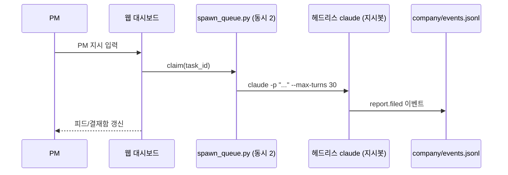
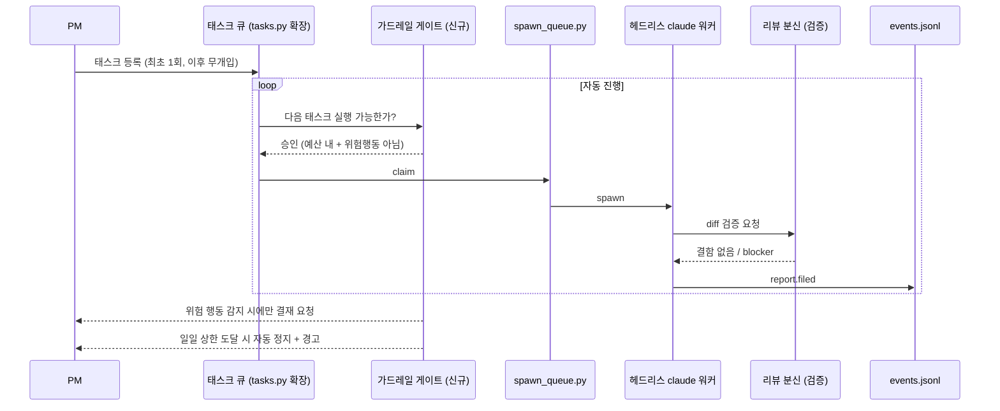

# [기획서] AI 팀 자율 파이프라인 — PM 개입 없는 태스크 생성→수행→검증→보고

> **상태**: 진행중 (방향 확정: A안) · **작성자**: 클또리 · **작성일**: 2026-07-14
> 사용 후 frontmatter의 `status`/`updated`와 `tags`를 함께 갱신할 것.
> **범위 주의**: 이건 별도 프로젝트급 이니셔티브다. daily/에 안 쌓고 여기(specs/)에서 독립적으로 굴린다.

---

## ✅ 방향 결정 (2026-07-14)

**A안 채택 — CLI 중심 유지 + 관측형 대시보드.** 웹 대시보드에 실행권을 위임하는 B안은
기각. 젬또리(agy) 교차검토 결과도 A안을 강력 권장(근거: PM 인지부하, 구현 공수, 지갑방어
용이성, Git 충돌 위험 4개 축 — 상세는 `specs/ai-team-autonomous-pipeline-review.md`).

이 결정에 따라 아래 3-1/3-2 아키텍처의 "웹 대시보드"는 어디까지나 **관측 + 결재함**
역할에 머문다. 실행 주체는 계속 CLI/백그라운드 헤드리스 claude 워커(`spawn_queue.py`)
뿐이며, 자율화는 "PM이 매번 트리거"를 "태스크 큐가 자동 트리거"로 바꾸는 것이지
"웹 UI가 실행권을 갖는 것"이 아니다.

> 젬또리 보고서의 구체적 인용(URL 2건, 에러코드 1건)은 클또리가 원문 대조로 오류를
> 확인·정정했다 — 아래 Phase 0 항목은 정정된 정보 기준. 핵심 논지(A안 권장, 리스크/완화
> 패턴)는 검증 결과 그대로 유효함.

---

## 1. 🎯 기능 개요 및 목적

* **해결하려는 문제**:
  현재 biz-ttori는 실제로 일하는 주체가 사실상 클또리(CLI, 이 대화) 하나뿐이다.
  웹 대시보드의 "조직도 봇"(코더봇A 등)은 `company/projects.json`에 이름만 있는
  순수 시각화 라벨이고, 실제 프로세스를 spawn하는 유일한 경로는 "PM 지시" →
  지시봇(헤드리스 claude 1회성 세션, 동시 2개 제한) 뿐이다. 즉 PM이 매번 대화로
  직접 지시해야만 뭔가 진행된다 — 완전 자동화와 거리가 멀다.

* **목표 (Goal)**:
  PM이 프로젝트/태스크를 등록해두면, 이후 개입 없이 파이프라인이 스스로
  ① 태스크 생성 → ② 수행(워커 spawn) → ③ 검증(리뷰 게이트) → ④ 보고(이벤트 기록)
  까지 자율 진행한다. 위험 행동(git push, 배포, 삭제성 작업)만 PM 결재를 거친다.

* **비목표 (Non-Goal, 이번 스펙에서는 다루지 않음)**:
  - 실제 구현 코드 작성 — 이 문서는 설계/방향 합의용. 구현은 Phase별로 별도 착수.
  - 젬또리(Antigravity CLI, `agy`) 자체의 자동화 — 별개 제품/인증 모델이라 범위 밖.
    필요시 별도 스펙으로 분리.
  - 조직도 봇 UI 자체의 재설계(이름/부서 편집 UX) — 백엔드 실행 연결에만 집중.

---

## 2. 👥 사용자 시나리오

1. PM이 대시보드(또는 CLI)에서 프로젝트에 태스크를 몇 건 등록한다.
2. 파이프라인이 대기 큐에서 태스크를 자동으로 꺼내 워커(헤드리스 claude 세션)를 spawn한다.
3. 워커가 태스크를 수행하고 결과를 `report.filed` 이벤트로 남긴다.
4. 결과가 "위험 행동"(git push/배포/삭제 등)을 포함하면 결재함에 올라가고, PM이 승인해야
   다음 단계로 진행된다. 위험하지 않은 작업은 자동으로 완료 처리된다.
5. 오늘 누적 토큰/비용이 하드 상한에 도달하면, 신규 워커 spawn이 자동 차단되고
   대시보드에 경고가 뜬다(그 시점까지 진행된 작업은 보존).
6. PM은 대시보드 현황판·3D 사무실에서 지금 몇 개의 워커가 무슨 태스크를 하고 있는지,
   오늘 얼마나 썼는지를 실시간으로 관찰만 하면 된다.

---

## 3. 🏗️ 아키텍처 & 데이터 흐름

### 3-1. 지금 있는 것 (변경 없이 재사용)

이 경로(`_spawn_order_worker`, `dashboard/engine/spawn_queue.py`)는 이미 검증된 유일한
실행 경로다 — 재귀 스폰 금지·좁은 스코프 프롬프트·`--max-turns` 상한이 이미 적용돼 있다.
**자율 파이프라인은 이 경로를 "PM이 매번 트리거"에서 "태스크 큐가 자동 트리거"로 확장하는
것**이지, 새 실행 메커니즘을 처음부터 만드는 게 아니다.

### 3-2. 목표 아키텍처 (자동 트리거 + 신규 가드레일)

### 3-3. 가드레일 — 유지 vs 신규/변경 (2026-07-14 PM 결정)

| 가드레일 | 상태 | 비고 |
|:---|:---|:---|
| 재귀 스폰 금지 (봇이 봇을 못 띄움) | **유지** | 지갑방어와 무관하게 항상 필요 — 없으면 기하급수 폭주 |
| 좁은 스코프 프롬프트 + `--max-turns` | **유지** | 세션 1개가 무한정 도는 것 방지 |
| 짧은 구조화 리턴 (원문 덤프 금지) | **유지** | 클또리/PM 컨텍스트 오염 방지 |
| 감사 로그 (events.jsonl append-only) | **유지** | 사후 추적 SSOT, 자동화 확대에도 그대로 신뢰 가능 |
| "PM이 손으로만 트리거" (T1 강제) | **대체 대상** | 이번 스펙의 핵심 변경점 — 아래 신규 장치로 보완 |
| **5시간 크레딧 잔량 하한 (20%)** | **신규 (v1 채택, PM 결정 2026-07-15)** | 구독형이라 USD 단가 계산 불필요. 5시간 롤링 크레딧 **잔량이 20% 이하로 떨어지면** `spawn_queue.claim`이 신규 spawn을 거부하도록 확장 |
| **위험 행동만 결재 게이트** | **신규 (v1 채택)** | git push/배포/삭제성 작업을 판정하는 **블랙리스트**(패턴 매칭, append-only로 축적) — 오탐이 안전한 방향 |
| 동시성 캡 상향 | **보류** | 1단계(Phase 1)는 기존 2개 유지, 실사용 검증 후 Phase 2에서 상향 검토 |

---

## 📅 4. 마일스톤 및 일정 (Phase 분할)

* **Phase 0 — 가드레일 구현** (자동화 착수 전 선행):
  - **⚠️ 선결 검증(가장 먼저)**: 5시간 롤링 크레딧 **잔량 %를 프로그램이 자동으로 읽을 수 있는지** 확인.
    `/usage`는 사람이 보는 출력이라, `spawn_queue.py`가 긁을 수 있는 API/파일/명령 경로가 있어야 20%룰이 성립.
    안 되면 이 항목 전체가 막히므로 Phase 0 착수 전 첫 번째로 확인한다.
  - `company/spend-limit.json`(또는 유사 설정)에 **크레딧 잔량 하한(`min_credit_pct: 20`)** 정의.
    구독형이라 USD 단가 계산은 불필요 — 5시간 창 잔량 %만 본다.
  - `spawn_queue.py claim`에 "5시간 크레딧 잔량 조회 → 20% 이하면 신규 spawn 거부" 로직 추가
  - "위험 행동" 판정 규칙 정의 (예: 커맨드에 `git push`, `rm -rf`, 배포 스크립트 매치 시
    `requires_approval` 강제) — 화이트리스트가 아니라 **위험 패턴 블랙리스트 매칭**이며,
    사고가 날 때마다 패턴을 계속 추가하는 **append-only** 방식(오탐=과잉 차단이 안전한 방향)
  - **젬또리 사용량 자기 보고 자동화 (1안 채택)**:
    - 젬또리 CLI 세션이 실행 중인 시간 동안, 에이전트 루프 내의 비동기 백그라운드 타이머(예: 15분 주기 또는 API 10회 누적 호출 시)를 통해 자신의 `/usage` 쿼터 잔량을 파악하여 `health.py report`를 자동 실행하는 백그라운드 갱신 로직을 구축합니다.
  - **젬또리 활동 이벤트 감사 로그 (events.jsonl) 연동**:
    - 젬또리 CLI 세션 내에서 주요 실무 작업(기획서 검토, 팩트체크 리서치 등) 완료 및 세션 종료 시점에, 수행한 활동 요약(Summary)을 `company/events.jsonl` 파일에 `{"type": "bot.done", "actor": "젬또리", ...}` 포맷으로 직접 추가(Append)해 주는 훅 또는 헬퍼 스크립트를 구현하여 대시보드 이벤트 타임라인에 실제 활동 내용이 기록되도록 보완합니다.
  - **참고 구현 패턴 — 외부 프레임워크 도입 기각 (PM 결정 2026-07-15):**
    LiteLLM Proxy / LangGraph 모두 **도입하지 않는다.**
    - LiteLLM Proxy는 **API키별 USD 예산 프록시**라 구독형 + "크레딧 잔량 %" 룰과 아예 안 맞는다
      (토큰 과금을 안 하니까). 우리 가드레일은 5시간 잔량 %를 읽는 것이지 비용을 적산하는 게 아니다.
    - LangGraph Interrupt도 우리가 필요한 "플래그 세우고 PM 승인 대기"를 무겁게 하는 것 — 지금 있는
      `events.jsonl` + 플래그 파일로 충분.
    - 결론: **파일 기반 자체 구현.** 외부 의존성 0. (참고용으로 남긴 원 링크·정정 이력은 review 문서 참조)

* **Phase 1 — 단일 워커 자동 트리거 프로토타입**:
  - 태스크 큐(간단하게는 `tasks.py`가 이미 하는 상태 판정을 확장) → 대기 태스크 있으면
    PM 개입 없이 자동으로 `spawn_queue.claim` 호출
  - 동시성은 기존 2개 그대로, 프로젝트 1개로 한정해 시범

* **Phase 2 — 확장**:
  - 검증된 프로토타입 기준으로 동시성 캡 상향 검토
  - 조직도 봇 이름(코더봇A 등)과 실제 워커 인스턴스 매핑 — 대시보드에서 "이 봇이 지금
    이 태스크를 하고 있다"가 실제와 일치하게

* **Phase 3 — 자율 검증 루프**:
  - 리뷰 분신 게이트를 파이프라인에 통합 (결함 있으면 자동 반려/재시도)
  - 실패 시 재시도 횟수·에스컬레이션 정책 확정

---

## 5. ✅ 미결 이슈 → PM 결정 (2026-07-15)

* **① 상한 — 결정: "5시간 크레딧 잔량 20% 하한".** 구독형이라 USD 단가 계산 불필요. 5시간 롤링
  크레딧 잔량이 20% 이하로 떨어지면 신규 워커 spawn 자동 차단.
  (선결: 잔량 %를 프로그램이 읽을 수 있는지 먼저 검증 — Phase 0 첫 항목)
* **② 위험 행동 판정 — 결정: 텍스트 패턴 블랙리스트로 시작, append-only로 계속 축적.**
  정교한 분류는 지금 불필요. 사고 날 때마다 패턴 추가.
* **③ 재시도 정책 — 결정: 실패 유형별로 분기 (아래).**
  - **인프라/일시적 실패**(spawn 실패, 타임아웃, 네트워크): **깨끗한 상태로 리셋 후 1회만 자동 재시도.**
  - **리뷰 블로커 / 로직 실패**(diff는 나왔는데 결함): 자동 재시도 금지 → **즉시 PM 에스컬레이션.**
    (같은 프롬프트 재시도는 십중팔구 재실패 + 크레딧 낭비)
  - ⚠️ 재시도는 반드시 **worktree/브랜치 리셋 후** 시작(부분 편집 중첩 방지). 재시도 후에도 실패면 무조건 정지(자동 루프 금지).
* **④ Phase 1 시범 프로젝트 — 결정: biz-ttori 자체 툴로만 시작. 실프로젝트(fanbird/close) 금지.**
  - 근거: 폭발 반경 — fanbird는 앱스토어 배포 직전이라 검증 안 된 오토파일럿을 붙이면 안 됨.
    biz-ttori 문서/인덱스 작업은 되돌리기 쉽고 git 추적되며 PM이 품질 즉시 판별 가능.
  - 시범 태스크 후보: `gbrain-doctor.sh` 깨진 링크 점검, 일지 인덱스 정리, `g-brain-map` 갱신, 문서 교차검사.
  - **승격 경로**: 자체툴 검증 → 실프로젝트는 **읽기전용/분석 태스크부터**(diff 요약, TODO 탐색) →
    안정화 후 실코드 작성 허용(fanbird 배포·안정화 이후).
* **⑤ 외부 프레임워크 — 결정: LiteLLM/LangGraph 도입 기각, 파일 기반 자체 구현.**
  LiteLLM은 USD 예산 프록시라 구독형과 불일치, LangGraph Interrupt는 과설계. `events.jsonl`+플래그로 충분.

---

## 🔗 6. 관련 노트 (G-Brain 링크)

* **관련 코드 모듈(G1)**: `dashboard/engine/spawn_queue.py`, `dashboard/engine/tasks.py`,
  `dashboard/engine/serve.py`(`_spawn_order_worker`) — 기존 실행 경로, Phase 1에서 확장 대상
* **정책 문서**: 프로젝트 루트 `CLAUDE.md` "AI 호출 3단계 정책" — 이 스펙이 실행되면
  해당 섹션 개정 필요 (T1 "PM 손 실행 강제" 조항의 예외 규정 추가)
* **지식 인덱스**: [[g-brain-map]]
