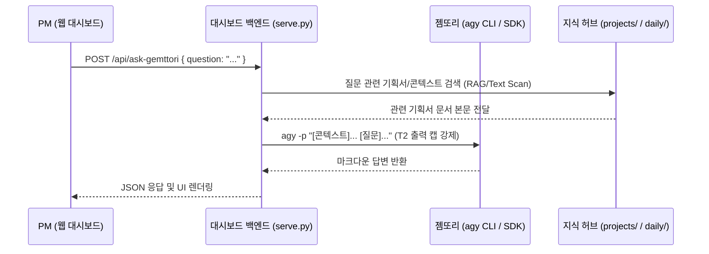

# 📋 [설계서] 대시보드 내 젬또리 전담 질문창 (Ask Jemori Panel) 기획서

본 문서는 클또리(Claude Code)의 토큰 소모 및 비용 집중을 방어하고, 상대적으로 넉넉한 젬또리(Antigravity)의 구독 리소스를 활용하여 프로젝트 기획/현황 쿼리를 전담 처리하기 위한 **대시보드 내 젬또리 전담 질문창(Ask Jemori)**의 기술 설계서입니다.

---

## 1. 🎯 기획 목적 및 배경

### 해결하려는 문제
* **클또리의 토큰/비용 과부하**: 단순 기획 스펙 질문, 문서 검색, 프로젝트 상태 브리핑 요약 등은 고성능/고비용의 클또리(Claude)를 굳이 쓰지 않고 젬또리(Gemini)가 처리해도 충분한 영역입니다.
* **지갑 방어 최적화**: 클또리 구독 쿼터(5시간 리밋)는 실제 코드 작성과 버그 해결 등 초고난도 실무에 집중시키고, 상대적으로 여유로운 젬또리의 5시간 구독 자원을 단순 질의응답 및 리서치에 소모함으로써 비용 효율성을 극대화합니다.

### 목표 (Goal)
* 웹 대시보드 상에 **"🔍 젬또리에게 물어보기"** 패널을 구축하여, 프로젝트 기획이나 문서 정리 상태에 대한 자연어 질문에 실시간 마크다운 답변을 제공합니다.
* **T2 출력 캡(40줄 제한)**을 강제하고, 젬또리의 지식 검색 범위를 워크스페이스 볼트(`projects/`, `daily/`)로 제한하여 환각 없는 정확한 지식 기반 답변을 보장합니다.

---

## 👥 2. 사용자 시나리오 (User Scenario)

1. PM이 대시보드를 보던 중, `"FMS 프로젝트의 API 명세가 정의된 spec 경로가 어디야?"` 혹은 `"오늘 close 프로젝트에 추가된 대기 화면 스펙 요약해줘"`라고 젬또리 질문창에 입력합니다.
2. 젬또리 백엔드가 가동되어 프로젝트 볼트 내 문서들을 검색/참조한 후, 3~5초 이내에 마크다운 형식으로 깔끔하게 포맷된 요약 답변을 제공합니다.
3. 클또리의 실측 토큰 잔량에는 아무런 변화가 없고, 젬또리의 5시간 크레딧만 안전하게 소모됩니다.

---

## 🏗️ 3. 아키텍처 & 데이터 흐름



---

## 💻 4. 세부 구현 스펙

### 4.1. 백엔드 API 신설 (`serve.py`)
- **엔드포인트**: `/api/ask-gemttori` (POST)
- **요청 바디**:
  ```json
  {
    "question": "오늘 fanbird 프로젝트에서 어떤 예외 사항들이 사양서에 정리되었니?"
  }
  ```
- **백엔드 구동 메커니즘**:
  - `serve.py` 내부에서 해당 질문이 들어오면, `projects/` 및 `daily/260715.md` 등 최근 활성 문서의 텍스트 일부를 컨텍스트로 취합합니다.
  - 젬또리 CLI를 비대화형 모드로 래핑 실행하여 프롬프트를 넘겨줍니다.
    ```bash
    agy --model="Gemini 3.5 Flash" -p "[컨텍스트]\n{context_text}\n\n[질문]\n{question}\n\n규칙: 40줄 이내로 핵심만 마크다운으로 답변하라."
    ```
  - 획득한 답변을 클라이언트에게 반환합니다.

### 4.2. 프론트엔드 UI 구성 (`dashboard/web/`)
* 대시보드 하단 우측 또는 별도 탭에 고정된 **"Ask Gemttori 🔍"** 채팅 인터페이스 신설.
* 답변 로딩 시 젬또리용 전용 로딩 스피너(청록색 테마) 노출.
* 마크다운 렌더링 라이브러리를 통해 결과물 시각화.

---

## 📅 5. 마일스톤 및 일정 (Phase 분할)

* **Phase 1 — 단순 질문 연동 (공수: 1일)**:
  * `/api/ask-gemttori` 엔드포인트 추가 및 `agy` 셸 실행 연동.
  * 대시보드 HTML/JS에 심플한 질문 입력 폼 및 답변 텍스트 출력창 구현.
* **Phase 2 — 지식 볼트 RAG 검색 연동 (공수: 2일)**:
  * 질문 키워드를 기반으로 `projects/` 하위 마크다운 본문을 탐색하여 젬또리에게 컨텍스트로 흘려보내 주는 간단한 로컬 검색 모듈(Python 내장) 연동.
  * 마크다운 렌더러 적용으로 디자인 퀄리티 고급화.
