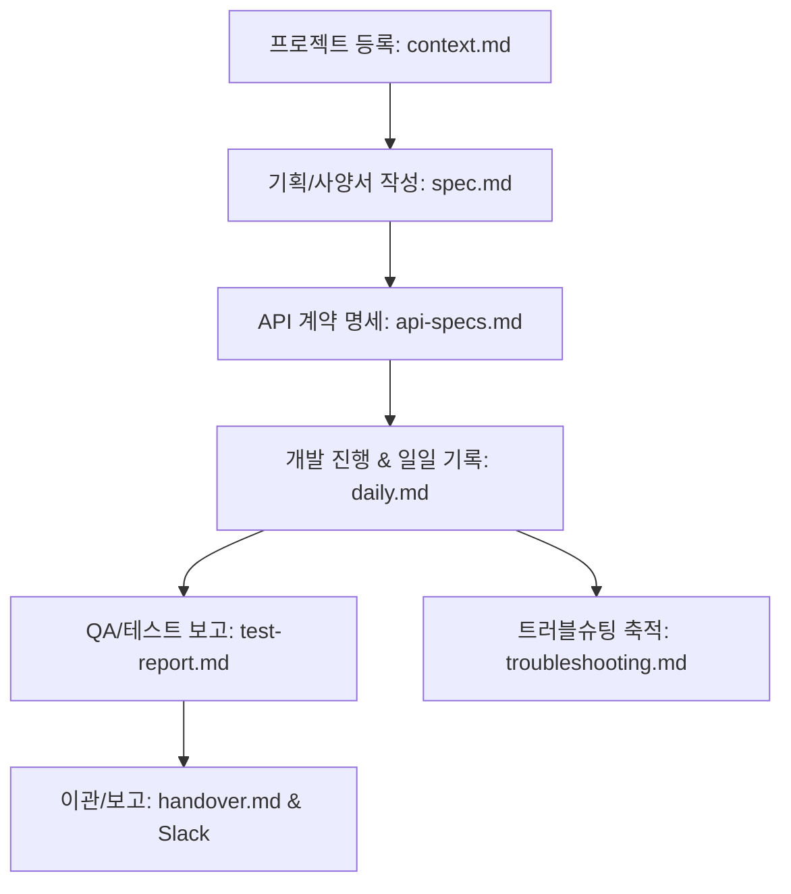

# 📖 [기획서] biz-ttori 표준 문서화 프레임워크 (Documentation Framework)

이 문서는 biz-ttori 협업 환경에서 PM과 에이전트(클또리/젬또리) 간의 비동기 지식 전달을 오차 없이 수행하고, AI의 코드 구현 및 리서치 품질을 물리적으로 제어하기 위한 **표준 문서 체계와 템플릿 양식 기획서**입니다.

---

## 1. 🎯 기획 목적
* **협업 일관성 확보**: AI 에이전트마다 문서 작성 형식이나 깊이가 어긋나 지식 파편화가 발생하는 것을 방지합니다.
* **지식 무결성 유지 (G-Brain)**: 문서 간의 링크(`[[위키링크]]`)가 잘못 유추되거나 누락되는 것을 프레임워크 양식 차원에서 기계적으로 가이드합니다.
* **체계적 히스토리 추적**: 기획 ➡️ 개발 ➡️ 검증 ➡️ 보고의 전체 릴리즈 라이프사이클을 서면으로 추적 가능하게 만듭니다.

---

## 📂 2. 필요한 문서군 및 정의 (Release Lifecycle 기준)

개발 및 기획 협업의 흐름에 따라 필요한 문서군을 다음과 같이 정의합니다.



### 2.1. 문서 분류 체계
| 구분 | 문서명 | 역할 | 작성 시점 |
| :--- | :--- | :--- | :--- |
| **선언 (Genesis)** | `project-context.md` | 프로젝트 구조, 실코드 절대경로, 레포 주소 정의 | 새 프로젝트 착수 시 최초 1회 |
| **기획 (Planning)** | `spec.md` | 기능 개요, 시나리오, 아키텍처, 일정(Phase) 기획 | 개발/구현 착수 전 필수 작성 |
| **계약 (Contract)** | `api-specs.md` | FE ↔ BE 간의 데이터 요청/응답 JSON 스키마 명세 | API 구현 시작 전 필수 작성 및 합의 |
| **기록 (Tracking)** | `daily.md` | 일일 개발 진척 상황, 실기기 스크린샷 및 사내 보고용 요약 | 매일 세션 종료 시 작성 |
| **검증 (Quality)** | `test-report.md` | 시나리오별 QA 수행, 실기기/에뮬레이터 빌드 통과 여부 기록 | 배포/릴리즈 직전 수행 |
| **교훈 (Archive)** | `troubleshooting.md` | 디버깅 과정에서 얻은 캐시 삭제 패턴, SDK 한계 등 기록 (신규) | 트러블슈팅 해결 즉시 기록 |
| **소통 (Inbox)** | `handover.md` | 에이전트 간 업무 이관 및 검수 요청 (신규) | 비동기 우체통(inbox.md) 이관 시 |

---

## 📋 3. 신규 템플릿 양식 제안

기존에 구비된 6종의 템플릿(`_templates/` 하위) 외에, **지식 전파와 디버깅 효율 극대화**를 위해 추가로 필요한 2종의 템플릿 규격을 신설합니다.

### 3.1. [신규] 트러블슈팅 로그 템플릿 (`_templates/troubleshooting-template.md`)
개발 중 기기 빌드 실패, 라이브러리 캐시 꼬임, IVS SDK 폭주 버그 등 **시간을 많이 소모한 트러블슈팅 내역**을 아카이빙하여 다음 개발 시 동일 삽질을 방지합니다.

```markdown
---
type: troubleshooting
project: "{프로젝트명}"
date: "YYYY-MM-DD"
author: "{작성자}"
tags: [type/troubleshooting, tech/{기술스택}]
---

# 🩺 [트러블슈팅] {발생한 버그 또는 장애 요약}

## 1. 🚨 증상 및 환경
* **발생 환경**: (예: Android 실기기, iOS 16 시뮬레이터, Metro 번들러 등)
* **에러 로그 / 스크린샷**:
  ```text
  [여기에 실제 터미널 에러 로그 또는 에러 코드 복사]
  ```

## 2. 🔍 원인 분석 (Root Cause)
* 에러가 발생한 근본적인 원인을 SDK 소스 분석 결과나 OS 동작 원리를 근거로 서술합니다.
* *예: 믹서 슬롯이 강제 해제되면서 슬롯 재바인딩 누락으로 블랙아웃 발생*

## 3. 💡 해결 방법 (Solution)
* 코드 수정 내역 또는 실행한 해결 명령어를 기록합니다.
* *예: 특정 슬롯 이름을 캡처한 뒤 명시적으로 바인딩 처리*

## 4. 🧠 축적된 교훈 (Key Lessons)
* 다음에 이 작업을 수행할 봇이나 PM이 주의해야 할 점을 기술합니다.
* **`memory/stack.md` 연동**: 본 교훈의 요약본을 `memory/stack.md`의 [공통 트러블슈팅] 테이블에 링크와 함께 추가해 주세요.
```

---

### 3.2. [신규] 업무 이관 보고서 템플릿 (`_templates/handover-template.md`)
우체통([inbox.md](file:///Users/linkcampus02/biz-ttori/memory/inbox.md))을 통해 에이전트 상호 간 검수 요청이나 인수를 진행할 때 사용하는 정형화된 우편 규격입니다.

```markdown
# 📬 {출발봇} ➔ {도착봇} 업무 이관 및 검수 요청서

> ⚠️ {도착봇}은 세션 시작 시 이 우편을 읽고 검수 및 후속 개발을 진행해 주세요.
> 작업이 완료되면 이 내용은 해당 날짜 일지 하단 아카이브로 이주하고 우체통을 비웁니다.

---

## 📅 인계 정보
- **작성일**: YYYY-MM-DD
- **작성자**: {출발봇 이름} (T2 자동 / T3 분신 / T1 젬또리)
- **인계 대상 마일스톤**: {예: Phase 1 자동 트리거 설계안 등}

---

## 📋 1. 완료된 작업 보고 (Completed Tasks)
* 이번 세션에서 물리적으로 변경하거나 구현을 마친 사항을 리스트업합니다.
* **정본 파일 경로**: (예: `projects/.../spec.md`)

---

## 🔍 2. 검수 요청 및 확인 필요 사항 (Review Points)
* 도착 에이전트가 중점적으로 교차검증해야 할 로직, 우회 구멍, 코드 충돌 리스크를 명시합니다.
* **검수 기준**: (예: `spawn_queue.py` 내 fcntl 파일 락이 race condition을 막기에 충분한지 확인 필요)

---

## 🔗 3. 관련 링크
* [g-brain-map](file:///Users/linkcampus02/biz-ttori/memory/g-brain-map.md)
* (관련 spec 문서 링크 제공)
```

---

## 📅 4. 문서 관리 정책 (Lifecycle Rule)

1. **Confirm 필수 규칙**: 모든 코딩 작업은 반드시 `Confirm (Step 2)` 단계에서 기획서(`spec.md`)와 `api-specs.md`가 Confirm 완료(상태: 진행중) 상태여야 개발에 착수할 수 있습니다.
2. **동기화 규칙**: 파일 생성 및 이동 발생 시, 기동 훅 또는 수동 명령어를 통해 `g-brain-map.md` 인덱스를 즉시 갱신하고 `gbrain-doctor.sh`로 깨진 링크가 없는지 항시 확인합니다.
3. **일지 연동**: 실무 이력 완료 시, 당일 일지 하단의 `## 사내 보고 요약` 란에 복사용 텍스트를 반드시 남겨 공유 작업을 서포트합니다.
