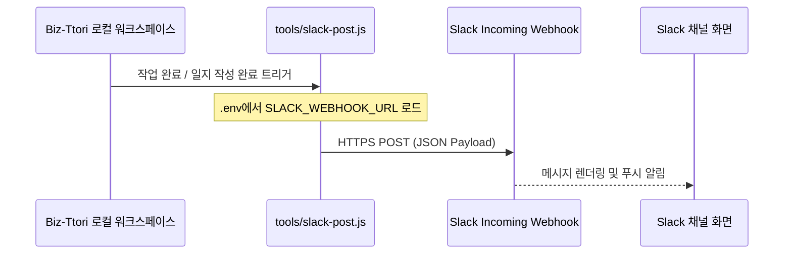
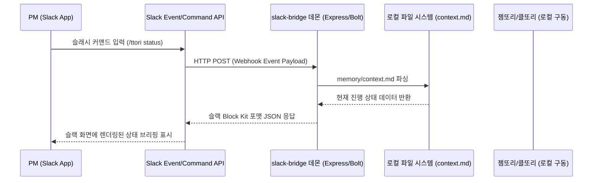

# [기획서/사양서] Biz-Ttori Slack 연동 스펙 (slack-bridge)

> **작성일**: 2026-06-30 | **작성자**: 젬또리 (Antigravity)
> **태그**: #type/spec #status/진행중 #project/biz-ttori
> **배포여부**: is_public: false

---

## 1. 🎯 기능 개요 및 목적

### 해결하려는 문제
* **수동 공유 공수**: AI 에이전트(클또리, 젬또리)나 PM이 일일 업무 일지(`daily/`)나 회의록(`meeting-minutes`)을 작성한 후, 슬랙 채널에 요약본을 복사해서 매번 수동으로 공유하는 과정이 번거롭고 누락되기 쉽습니다.
* **진행 상황 모니터링 한계**: 에이전트의 현재 작업 진행도, 블로커 상황(`memory/context.md`)을 외부에서 파악하려면 반드시 로컬 터미널을 열거나 옵시디언 볼트를 확인해야 하므로 접근성이 떨어집니다.
* **실시간 상호작용 부재**: 슬랙을 통해 가볍게 에이전트의 동작을 트리거하거나, 현재 진행 상태를 간편하게 업데이트할 수 있는 접점이 없습니다.

### 목표 (Goal)
* **1단계 (단방향 알림)**: 문서 작성 및 태스크 완료 시 슬랙 공유 템일릿의 내용을 특정 슬랙 채널에 자동으로 포스팅하는 도구(`slack-bridge` 알림) 구축.
* **2단계 (양방향 제어)**: 슬랙 슬래시 커맨드(`/ttori`)를 통해 로컬 워크스페이스의 상태(`memory/context.md`)를 조회하고 할 일을 추가하는 기능 구현.
* **3단계 (에이전트 연계 & 지갑 방어)**: 슬랙 채널 내에서 에이전트에게 간단한 조사나 리뷰 지시를 내리되, 토큰 폭탄을 막기 위해 **출력 제한(T2 캡)** 및 **승인 프로세스(Interactive Button)**가 가동되는 상호작용 환경 구축.

### 비목표 (Non-Goal)
* 슬랙 내에서 제한 없는 무제한 에이전트 대화 및 무한 루프 생성 (비용 방어를 위해 철저히 차단).
* 대용량 파일 업로드 분석 및 복잡한 코드 작성 작업을 슬랙에서 직접 수행하는 것 (이는 로컬 터미널 및 T1 주체 영역으로 한정).

---

## 2. 👥 사용자 시나리오 (User Scenario)

### 시나리오 1: 일지 및 보고서 자동 포스팅 (Phase 1)
1. 클또리(Claude Code) 또는 개발자가 업무 일지(`daily/`) 작성을 마치거나 `Step 7. SLACK REPORT` 단계에 진입합니다.
2. 시스템이 작성된 공유용 요약본 텍스트를 인지하여 `tools/slack-post` 스크립트를 실행합니다.
3. 지정된 슬랙 채널(예: `#biz-ttori-status`)에 깔끔하게 서식이 적용된 업무 요약이 전송됩니다.

### 시나리오 2: 슬랙에서 워크스페이스 상태 조회 및 수정 (Phase 2)
1. PM이 외부 이동 중에 모바일 슬랙 앱에서 `/ttori status`를 입력합니다.
2. 슬랙 앱이 로컬/서버의 `slack-bridge` 데몬을 통해 `memory/context.md` 파일의 현재 상태를 읽어옵니다.
3. 슬랙 화면에 "현재 진행 단계, 다음 할 일 목록, 블로커"가 정리되어 출력됩니다.
4. PM이 `/ttori todo 슬랙 2단계 연동 스크립트 작성`을 입력하면, 자동으로 `context.md` 파일에 할 일이 추가되고 저장됩니다.

### 시나리오 3: 슬랙을 통한 조사 지시 및 PM 승인 (Phase 3)
1. PM이 슬랙에서 `@Biz-Ttori [특정 라이브러리 조사해줘]`라고 멘션합니다.
2. 봇이 질문을 인식하고, 예상 비용과 리서치 범위를 평가한 뒤 슬랙에 `[승인 요청: 젬또리(agy) 리서치 가동]` 메시지와 함께 **[승인] / [반려]** 버튼을 보여줍니다.
3. PM이 **[승인]** 버튼을 누르면, 백엔드에서 젬또리(`agy`)가 구동되어 조사하고 요약된 결과(40줄/2000자 캡 준수)를 스레드 답글로 전달합니다.

---

## 🏗️ 3. 아키텍처 & 데이터 흐름

### Phase 1: Webhook 단방향 알림 흐름

### Phase 2 & 3: 양방향 Slack App 흐름

---

## 📅 4. 마일스톤 및 일정 (Phase 분할)

### Phase 1: Webhook 기반 단방향 알림 구현 (공수: 1~2일)
* **세부 작업**:
  * 슬랙 채널 및 수신용 Incoming Webhook 생성
  * `keys/.env`에 `SLACK_WEBHOOK_URL` 환경변수 추가 및 `setup.sh` 연동 검증
  * `tools/slack-post.js` 구현 (Node.js 기본 http 모듈 또는 axios 활용, 의존성 최소화)
  * 일지 작성 및 템플릿 처리 시 해당 스크립트를 자동 트리거하도록 가이드 설정

### Phase 2: Slack Bolt 앱을 이용한 양방향 상태 제어 (공수: 3~4일)
* **세부 작업**:
  * Slack API 개발자 포털에서 `Biz-Ttori` 앱 생성
  * `/ttori` 슬래시 커맨드 등록 및 로컬 터널(ngrok 등) 테스트 환경 구축
  * Express.js 또는 Slack Bolt 프레임워크 기반의 가벼운 백엔드 데몬 소스 작성
  * 로컬 파일(`memory/context.md`)을 읽고 쓸 수 있는 파일 입출력(I/O) 모듈 구현

### Phase 3: 지갑 방어 통합 및 인터랙티브 승인 프로세스 (공수: 4~5일)
* **세부 작업**:
  * 슬랙 멘션 수신 시 젬또리(`agy-ask.sh`) T2 단답 호출용 연동 모듈 탑재
  * 토큰 캡(줄 수 및 글자 수 제한) 검증 로직 슬랙 단에 구현
  * Interactive Button API 연동을 통한 PM 실행 승인 시스템 개발

---

## 💡 추가 고려사항 & 트레이드오프

1. **로컬 구동 vs 클라우드 배포**:
   * 비즈또리는 개발자 개인의 로컬 머신에서 구동되는 오케스트레이터입니다.
   * **Phase 1**은 로컬 스크립트 실행으로 완결되므로 추가 인프라가 필요 없습니다.
   * **Phase 2 & 3**은 슬랙 서버의 HTTP 요청을 수신해야 하므로, 로컬 머신에서 `ngrok`을 켜두거나 가벼운 릴레이 서버(예: Supabase Edge Functions, Cloudflare Workers, 또는 개인 클라우드)에 컨텍스트 동기화용 미니 서버를 띄울지 판단이 필요합니다.
2. **단순함 유지**:
   * 초기에는 로컬에서 `git push`나 빌드가 완료되었을 때 실행되는 1단계 Webhook 방식을 정비하여 복잡한 세팅 없이 연동의 효용을 먼저 느끼는 것을 강력 권장합니다.
